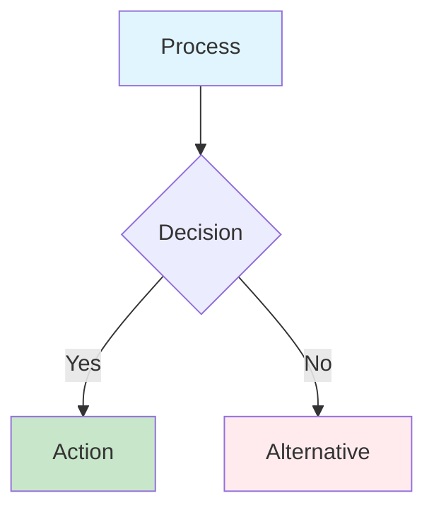

# System Diagrams Documentation

This directory contains comprehensive visual documentation of the agentic coding workflow system behavior. The diagrams are organized by category and provide detailed explanations of system architecture, workflows, and operational procedures.

## 📋 Quick Navigation

### 🏗️ Architecture Diagrams
Understanding the system structure and component relationships:

- **[System Overview](architecture/system-overview.md)** - High-level architecture showing all components and their interactions
- **[Component Interactions](architecture/component-interactions.md)** - Detailed interaction matrix showing who talks to whom

### 🔄 Workflow Diagrams
Step-by-step processes and decision flows:

- **[PR Monitoring](workflows/pr-monitoring.md)** - How PRs are discovered, tracked, and categorized
- **[Check Analysis & Fixing](workflows/check-analysis-fixing.md)** - From failure detection to automated fix application
- **[PR Review Process](workflows/pr-review.md)** - Multi-agent review orchestration and consensus building
- **[PR State Machine](workflows/pr-state-machine.md)** - Complete PR lifecycle with all possible state transitions

### 📊 Sequence Diagrams
Detailed timing and interaction sequences:

- **[Failed Check to Fix](sequences/failed-check-to-fix.md)** - Step-by-step process from check failure to resolution
- **[PR Review Process](sequences/pr-review-process.md)** - Multi-agent review coordination and decision making

### ⚙️ Operational Diagrams
System operation, monitoring, and troubleshooting:

- **[Decision Logic](operational/decision-logic.md)** - Fix vs escalate decision tree with safety thresholds
- **[Error Handling](operational/error-handling.md)** - Comprehensive error recovery and circuit breaker strategies
- **[Monitoring Dashboard](operational/monitoring-dashboard.md)** - Metrics, alerts, and observability structure

## 🎯 How to Use These Diagrams

### For Developers
- Start with **System Overview** to understand the architecture
- Review **Workflow Diagrams** to understand process flows
- Use **Sequence Diagrams** for detailed implementation guidance
- Reference **Decision Logic** for understanding automation rules

### For Operations Teams
- Focus on **Error Handling** for troubleshooting procedures
- Use **Monitoring Dashboard** for setting up observability
- Review **Component Interactions** for dependency management

### For Product/Business Teams
- **System Overview** provides the big picture
- **PR State Machine** shows the user experience flow
- **Monitoring Dashboard** explains success metrics

## 🔍 Diagram Categories Explained

### Architecture Diagrams
These diagrams show the static structure of the system - what components exist and how they're connected. They help understand:
- System boundaries and external dependencies
- Component responsibilities and interfaces
- Event flow patterns and communication protocols

### Workflow Diagrams
These show dynamic behavior - how the system responds to events and makes decisions. They illustrate:
- Business process flows
- Decision points and branching logic
- State transitions and lifecycle management

### Sequence Diagrams  
These provide detailed timing and interaction sequences for specific scenarios. They show:
- Exact order of operations
- API calls and responses
- Error paths and retry logic
- Performance bottlenecks

### Operational Diagrams
These focus on running and maintaining the system in production. They cover:
- Error detection and recovery
- Monitoring and alerting strategies
- Decision algorithms and safety mechanisms

## 📐 Diagram Standards

### Mermaid Syntax
All diagrams use Mermaid syntax for consistency and GitHub compatibility. Key elements:

### Color Coding
- **Blue** (`#e1f5fe`): Input/Start processes
- **Green** (`#c8e6c9`): Successful outcomes  
- **Red** (`#ffebee`): Error/Escalation paths
- **Orange** (`#fff3e0`): Analysis/Processing steps
- **Purple** (`#f3e5f5`): Fix/Transformation steps

### Common Symbols
- **Rectangles**: Processes or components
- **Diamonds**: Decision points
- **Circles**: Start/End points
- **Cylinders**: Data storage
- **Parallelograms**: Input/Output

## 🔄 Keeping Diagrams Updated

### When to Update
- Adding new system components
- Changing workflow logic
- Modifying error handling strategies  
- Adding new metrics or alerts

### Update Process
1. Modify the relevant diagram file
2. Update the explanation text
3. Verify Mermaid syntax renders correctly
4. Update this README if adding new diagrams
5. Commit changes with descriptive message

### Testing Diagrams
Before committing, verify diagrams render correctly:
- Preview in VS Code with Mermaid extension
- Check GitHub rendering after push
- Validate all links in README work correctly

## 🔗 Related Documentation

- **[REQUIREMENTS.md](../../REQUIREMENTS.md)** - Detailed system requirements
- **[CLAUDE.md](../../CLAUDE.md)** - Development guidelines and architecture
- **GitHub Issues** - Implementation tasks based on these diagrams

## 📞 Questions and Feedback

For questions about these diagrams or suggestions for improvements:
1. Open a GitHub issue with the `documentation` label
2. Reference the specific diagram file and section
3. Provide context about your use case or confusion

These diagrams are living documentation - they should evolve with the system to remain accurate and useful.