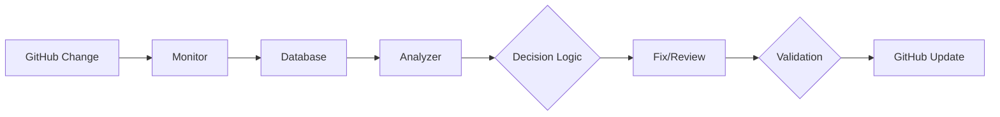
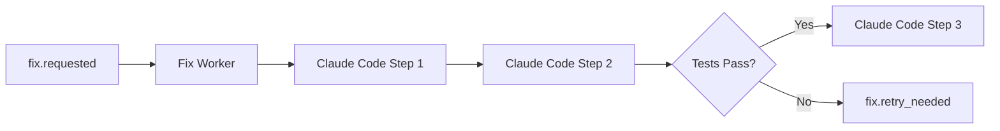
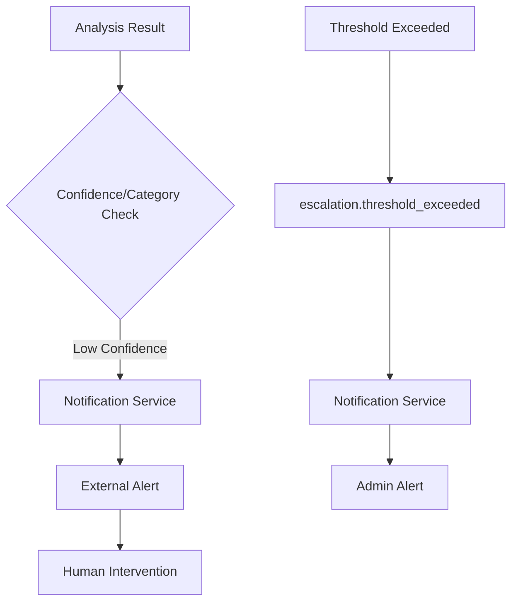
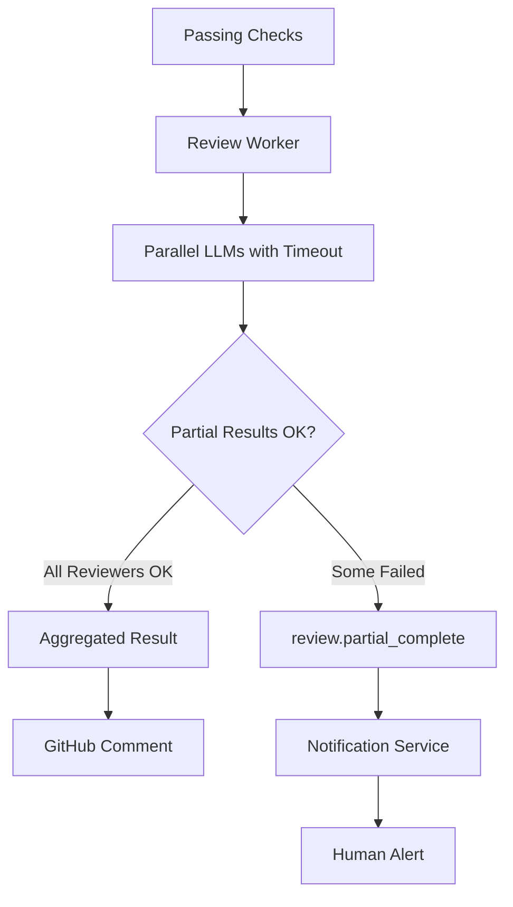
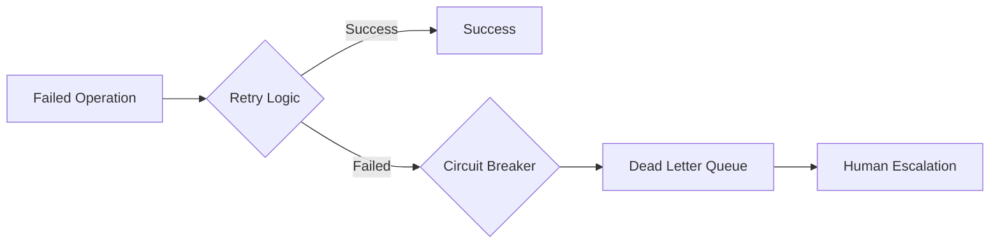

# Component Interaction Matrix

## Purpose
This matrix clearly defines how each component interacts with others in the system. It helps understand dependencies, data flow directions, and communication patterns.

## What It Shows
- **Data Sources**: What each component reads from
- **Data Destinations**: What each component writes to
- **Event Publishing**: What events each component publishes
- **Event Subscriptions**: What events each component listens for

## Key Insights
- **Loose Coupling**: Components communicate primarily through events
- **Single Responsibility**: Each component has clearly defined inputs and outputs
- **Event-Driven Architecture**: Most communication happens via publish/subscribe
- **Database Usage**: Clear patterns of who reads/writes what data

## Interaction Matrix

| Component | Reads From | Writes To | Publishes Events | Subscribes To | Error Handling |
|-----------|------------|-----------|------------------|---------------|----------------|
| **Monitor Worker** | GitHub API, Database | Database | `check.failed`, `pr.ready_for_review`, `escalation.threshold_exceeded` | Timer/Cron | Rate limit backoff, Circuit breaker |
| **Analyzer Worker** | GitHub API, Database, LLM APIs | Database | `fix.requested`, `analysis.failed`, `notification.send` | `check.failed` | LLM fallback providers, Retry with backoff |
| **Fix Worker** | Database, GitHub API | GitHub, Database | `fix.retry_needed`, `notification.send` | `fix.requested` | 3-step validation, Git rollback, Max retry limits |
| **Review Worker** | GitHub API, Database, LLM APIs | GitHub, Database | `review.partial_complete`, `fix.requested`, `notification.send` | `pr.ready_for_review` | Reviewer timeout handling, Partial review processing |
| **Notification Service** | Database | External Services | - | `notification.send`, `review.partial_complete`, `escalation.threshold_exceeded` | Dead letter queues, Service fallbacks |
| **Circuit Breaker Manager** | Service Health APIs | Database, Monitoring | `provider.circuit_breaker_open`, `provider.circuit_breaker_closed` | Service health events | Circuit state management |
| **Metrics Collector** | All Components | Monitoring DB, Dashboards | `alert.threshold_exceeded` | Component metrics | Aggregation failure handling |

## Detailed Component Analysis

### Monitor Worker
- **Purpose**: Continuously monitors GitHub for PR and check status changes
- **Input Dependencies**: GitHub API for real-time data, Database for historical state
- **Output Impact**: Triggers all downstream processing by publishing events
- **Communication Pattern**: Polling-based input, event-driven output

### Analyzer Worker
- **Purpose**: Performs multi-factor analysis of failed checks using sophisticated decision logic
- **Input Dependencies**: GitHub API for logs, Database for check history and success rates, LLM APIs for intelligent analysis
- **Output Impact**: Makes confidence-based decisions between automated fixing and human escalation
- **Communication Pattern**: Event-driven input/output, external LLM API calls with fallback providers
- **Decision Factors**: Confidence scores (>80% for automation), failure categories (security always escalates), historical success rates (>70% threshold), complexity assessment, retry attempt counting
- **Learning Integration**: Adapts thresholds based on fix success rates, updates failure pattern recognition, adjusts confidence calculations

### Fix Worker
- **Purpose**: Orchestrates automated fixes using Claude Code SDK's 3-step validation process
- **Input Dependencies**: Database for analysis context, GitHub API for repository access
- **Output Impact**: Validated code changes with test confirmation before commit
- **Communication Pattern**: Event-driven input, multi-phase API orchestration with rollback capability
- **Validation Process**: 
  1. Clone & Apply Fix (Claude Code Step 1)
  2. Run Tests & Linters (Claude Code Step 2) 
  3. Commit & Push only if tests pass (Claude Code Step 3)
- **Error Recovery**: Git rollback on test failures, retry with modified strategies, escalation after max attempts

### Review Worker
- **Purpose**: Orchestrates parallel multi-agent code reviews with timeout and retry handling
- **Input Dependencies**: GitHub API for PR diffs, Database for reviewer configuration and history
- **Output Impact**: Aggregated review decisions, individual review comments, partial review notifications
- **Communication Pattern**: Event-driven input, parallel processing with timeout management, graceful degradation
- **Timeout Handling**: Configurable reviewer timeouts (30s default), exponential backoff retries (max 3 attempts), dynamic timeout adjustment
- **Partial Review Processing**: Can proceed with available reviews if some reviewers fail, notifies humans about incomplete coverage
- **Reviewer Management**: Independent reviewer execution, failure isolation, retry mechanisms per reviewer

### Notification Service
- **Purpose**: Handles all human escalations and status notifications with multi-channel delivery
- **Input Dependencies**: Database for context, various workers for trigger events, partial review completion events
- **Output Impact**: Human awareness and intervention through multiple channels (Telegram, Slack, email)
- **Communication Pattern**: Event-driven input, external service output with delivery confirmation
- **Enhanced Features**: Partial review notifications, threshold exceeded alerts, priority-based routing, delivery failure handling

### Circuit Breaker Manager
- **Purpose**: Monitors external service health and manages circuit breaker states
- **Input Dependencies**: Service health APIs, response time metrics, error rate tracking
- **Output Impact**: Prevents cascade failures, enables graceful degradation
- **Communication Pattern**: Continuous health monitoring, event-driven state changes
- **States**: Closed (normal), Open (failing), Half-Open (testing recovery)

### Metrics Collector
- **Purpose**: Aggregates system-wide metrics for monitoring and alerting
- **Input Dependencies**: Performance data from all components, cost tracking, success rates
- **Output Impact**: Real-time dashboards, automated alerts, performance optimization data
- **Communication Pattern**: Pull-based metrics collection, push-based alerting

## Event Flow Patterns

### Primary Event Chain

### Enhanced Fix Chain

### Escalation Event Chain

### Review Event Chain with Error Handling

### Error Recovery Chain

## Data Access Patterns

### Read-Heavy Components
- **Monitor Worker**: Frequently reads GitHub API and database state, polls for changes
- **Review Worker**: Reads large PR diffs and historical review data, reviewer configurations
- **Metrics Collector**: Continuously reads component health and performance data

### Write-Heavy Components
- **Analyzer Worker**: Writes detailed analysis results, evidence, and confidence scores
- **Fix Worker**: Creates commits, updates PR status, logs fix attempts and results
- **State Machine Manager**: Frequent state transition logging, audit trail maintenance

### Read-Write Balanced
- **All Workers**: Balance reading configuration/context with writing results and metrics
- **Circuit Breaker Manager**: Reads service health, writes circuit states
- **Notification Service**: Reads event contexts, writes delivery status

### Metrics Aggregation
- **Time-Windowed Aggregation**: Buffered metrics aggregation for dashboard performance
- **Real-Time Alerting**: Immediate alerts based on threshold violations
- **Historical Analysis**: Long-term storage for trend analysis and capacity planning

## Communication Protocols

### Synchronous Communication
- Database reads/writes with connection pooling
- GitHub API calls with rate limit respect
- LLM API requests with timeout handling
- Claude Code SDK calls with validation checkpoints

### Asynchronous Communication
- Queue-based event publishing with guaranteed delivery
- Background job processing with priority queues
- Notification delivery with multiple channel fallbacks
- Metrics collection with buffered aggregation

### Advanced Error Handling
- **Dead Letter Queues**: Failed events quarantined for manual review
- **Retry Mechanisms**: Exponential backoff with jitter, per-operation max attempts
- **Circuit Breakers**: Service health monitoring, automatic failover, gradual recovery
- **Timeout Management**: Configurable per-operation timeouts, dynamic adjustment
- **Partial Success Handling**: Graceful degradation, incomplete result processing
- **Rollback Mechanisms**: Git state restoration, database transaction rollback
- **Fallback Strategies**: Alternative LLM providers, simplified processing modes

