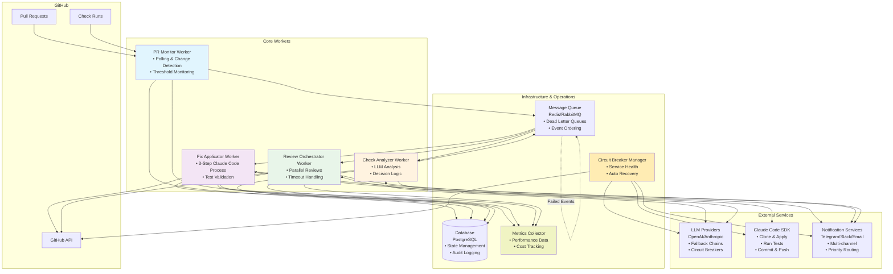

# System Architecture Overview

## Purpose
This diagram shows the high-level architecture of the agentic coding workflow system. It illustrates how all components interact, from GitHub integration to external services, and provides a bird's-eye view of the system's structure.

## What It Shows
- **Workers**: The four main processing workers with error handling and retry mechanisms
- **External Integrations**: GitHub API, LLM providers, Claude Code SDK, notification services
- **Infrastructure**: Message queues, database, and monitoring layers
- **Data Flow**: How information flows with error recovery and circuit breaker patterns
- **Operational Components**: Circuit breakers, metrics collection, and dead letter queues

## Key Insights
- **Separation of Concerns**: Each worker has a specific responsibility with clear interfaces
- **Async Communication**: Workers communicate through message queues with error handling
- **Resilience**: Circuit breakers, retries, and graceful degradation throughout
- **Scalability**: Workers can be scaled independently based on load and performance metrics
- **Observability**: Comprehensive monitoring and alerting across all components
- **Error Recovery**: Multiple layers of error handling and recovery mechanisms

## Diagram

## Component Descriptions

### Core Workers
- **PR Monitor Worker**: Polls GitHub for PR changes, manages thresholds, handles escalation triggers
- **Check Analyzer Worker**: Multi-factor analysis using LLMs with confidence scoring and learning integration
- **Fix Applicator Worker**: Orchestrates 3-step Claude Code process with test validation and rollback capability
- **Review Orchestrator Worker**: Manages parallel reviewers with timeout handling, retry logic, and partial review processing

### External Services
- **GitHub API**: Source of PR and check data, target for updates and comments
- **LLM Providers**: AI services for analysis and review (OpenAI, Anthropic, etc.)
- **Claude Code SDK**: Automated code fixing service
- **Notification Services**: Human escalation channels (Telegram, Slack, etc.)

### Infrastructure & Operations
- **Message Queue**: Async communication with dead letter queues and guaranteed delivery
- **Database**: Persistent storage with state management, metrics, and comprehensive audit logging
- **Metrics Collector**: Aggregates performance data, cost tracking, and success rates across all components
- **Circuit Breaker Manager**: Monitors service health, manages circuit states, and coordinates recovery procedures

## System Characteristics

### Resilience Features
- **Circuit Breakers**: Automatic failure detection and recovery for all external services
- **Retry Mechanisms**: Exponential backoff with jitter for transient failures
- **Dead Letter Queues**: Failed message quarantine for manual review and replay
- **Graceful Degradation**: Partial functionality when some components are unavailable
- **Rollback Capabilities**: Automatic state restoration on operation failures

### Performance Optimizations
- **Parallel Processing**: Workers and reviewers operate concurrently for maximum throughput
- **Load Balancing**: Worker scaling based on queue depth and processing time metrics
- **Resource Pooling**: Connection reuse for databases and external APIs
- **API Rate Limiting**: Respectful API usage with backoff strategies
- **Timeout Management**: Configurable timeouts with dynamic adjustment based on service performance

### Operational Excellence
- **Comprehensive Monitoring**: Real-time metrics, alerts, and dashboards for all components
- **Cost Tracking**: Detailed cost attribution for LLM usage, Claude Code operations, and infrastructure
- **Audit Logging**: Complete operation history for compliance and debugging
- **Health Checks**: Continuous monitoring of all system components with automated recovery
- **Configuration Management**: Dynamic configuration updates without service restarts

