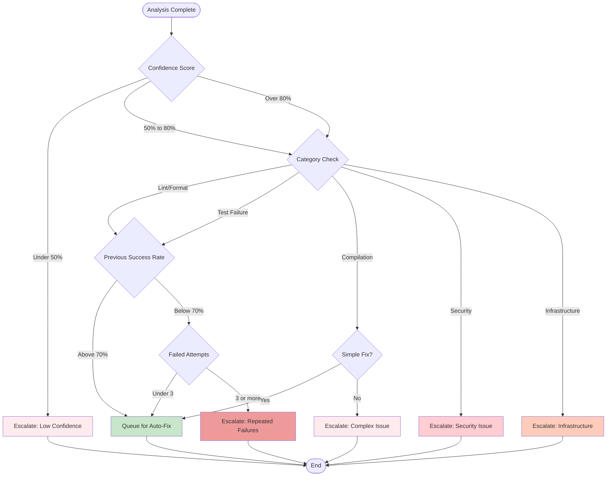

# Decision Logic: Fix vs Escalate

## Purpose
This diagram shows the decision tree that determines whether a failed check should be automatically fixed or escalated to human intervention. It illustrates the sophisticated logic that ensures only safe, high-confidence fixes are attempted automatically.

## What It Shows
- **Multi-Factor Decision Making**: How multiple criteria combine to make routing decisions
- **Safety Thresholds**: Conservative approaches to prevent harmful automated changes
- **Category-Specific Logic**: Different rules for different types of failures
- **Risk Mitigation**: Built-in safeguards against poor automation decisions

## Key Insights
- **Conservative by Design**: The system errs on the side of human review
- **Confidence-Driven**: High confidence scores are required for automation
- **Category Awareness**: Different failure types have different automation rules
- **Learning System**: Previous success rates influence future decisions

## Diagram



## Decision Criteria Explained

### Confidence Score Thresholds

#### Low Confidence (< 50%)
- **Meaning**: LLM is uncertain about the failure cause or fix approach
- **Action**: Always escalate to human review
- **Examples**: 
  - Ambiguous error messages
  - Complex integration failures
  - Novel error patterns

#### Medium Confidence (50-80%)
- **Meaning**: LLM has reasonable understanding but not complete certainty
- **Action**: Apply additional criteria before deciding
- **Examples**:
  - Common patterns with slight variations
  - Known issues in unfamiliar contexts

#### High Confidence (> 80%)
- **Meaning**: LLM is very certain about cause and solution
- **Action**: Proceed to category-specific evaluation
- **Examples**:
  - Standard linting errors
  - Well-known compilation issues
  - Common test failures

### Failure Categories

#### Auto-Fixable Categories

**Lint/Format Issues**
- **Description**: Code style, formatting, import organization
- **Success Rate**: Typically 90%+
- **Risk Level**: Very Low
- **Examples**: Missing semicolons, incorrect indentation, unused imports

**Simple Test Failures**
- **Description**: Assertion updates, mock adjustments
- **Success Rate**: 70-85%
- **Risk Level**: Low
- **Examples**: Expected value changes, API response format updates

**Basic Compilation Errors**
- **Description**: Missing imports, simple syntax errors
- **Success Rate**: 60-80%
- **Risk Level**: Medium
- **Examples**: Undefined variables, missing dependencies

#### Never Auto-Fixed Categories

**Security Issues**
- **Reasoning**: Requires human security expertise
- **Examples**: SQL injection, XSS vulnerabilities, authentication flaws
- **Escalation**: Security team review

**Infrastructure Failures**
- **Reasoning**: Often requires environment changes or external fixes
- **Examples**: Database connectivity, service unavailability, network issues
- **Escalation**: DevOps team review

### Success Rate Evaluation

#### High Success Rate (> 70%)
- **Criteria**: Historical success rate for similar fixes in this repository
- **Action**: Approve for automated fixing
- **Tracking**: Per-repository, per-category success rates

#### Low Success Rate (< 70%)
- **Criteria**: Recent fixes in this category have been failing
- **Action**: Additional scrutiny or escalation
- **Adaptation**: System learns from failures and adjusts thresholds

### Retry Logic

#### Fresh Attempts (< 3 previous failures)
- **Reasoning**: Give automation a chance to succeed
- **Conditions**: Different fix strategies may work
- **Monitoring**: Track attempt count per issue type

#### Repeated Failures (>= 3 attempts)
- **Reasoning**: Pattern indicates systematic issue
- **Action**: Human intervention needed
- **Learning**: Update failure patterns to prevent future auto-fix attempts

## Configuration Examples

### Repository-Specific Thresholds
```yaml
repositories:
  - name: "critical-service"
    thresholds:
      confidence_minimum: 90
      security_auto_fix: false
      max_retry_attempts: 1
      
  - name: "internal-tool"
    thresholds:
      confidence_minimum: 70
      security_auto_fix: false
      max_retry_attempts: 3
```

### Category-Specific Rules
```yaml
fix_categories:
  lint:
    enabled: true
    confidence_threshold: 60
    max_files_changed: 10
    
  test:
    enabled: true
    confidence_threshold: 80
    run_full_test_suite: true
    
  security:
    enabled: false
    always_escalate: true
    
  infrastructure:
    enabled: false
    always_escalate: true
```

## Advanced Decision Logic

### Complexity Assessment
```python
def assess_fix_complexity(analysis_result):
    complexity_factors = {
        'files_affected': len(analysis_result.files_to_change),
        'lines_changed': analysis_result.estimated_lines_changed,
        'dependencies_modified': len(analysis_result.dependencies_affected),
        'test_coverage_impact': analysis_result.test_coverage_change
    }
    
    # Simple fixes: 1-2 files, < 10 lines, no deps
    if (complexity_factors['files_affected'] <= 2 and 
        complexity_factors['lines_changed'] <= 10 and
        complexity_factors['dependencies_modified'] == 0):
        return 'simple'
    
    # Complex fixes: > 5 files, > 50 lines, or deps
    elif (complexity_factors['files_affected'] > 5 or
          complexity_factors['lines_changed'] > 50 or
          complexity_factors['dependencies_modified'] > 0):
        return 'complex'
    
    return 'medium'
```

### Risk Assessment
```python
def assess_fix_risk(analysis_result, repository_config):
    risk_score = 0
    
    # File importance scoring
    critical_files = repository_config.critical_file_patterns
    for file in analysis_result.files_to_change:
        if any(pattern in file for pattern in critical_files):
            risk_score += 3
    
    # Change magnitude
    if analysis_result.estimated_lines_changed > 20:
        risk_score += 2
    
    # Time sensitivity
    if repository_config.is_production_environment:
        risk_score += 2
    
    # Historical failure rate
    category_failure_rate = get_category_failure_rate(
        analysis_result.category, repository_config.name
    )
    if category_failure_rate > 0.3:  # 30% failure rate
        risk_score += 2
    
    return 'high' if risk_score >= 5 else 'medium' if risk_score >= 3 else 'low'
```

### Time-Based Factors
```python
def apply_time_factors(decision, current_time, repository_config):
    # Avoid fixes during business hours for critical services
    if (repository_config.is_critical and 
        is_business_hours(current_time, repository_config.timezone)):
        if decision == 'AUTO_FIX':
            return 'ESCALATE_TIMING'
    
    # Accelerate fixes for urgent PRs
    if repository_config.has_urgent_label:
        if decision == 'ESCALATE_COMPLEX':
            return 'AUTO_FIX'  # Take more risk for urgent fixes
    
    return decision
```

## Learning and Adaptation

### Success Rate Tracking
```python
class FixSuccessTracker:
    def update_success_rate(self, repository, category, success):
        key = f"{repository}:{category}"
        current_rate = self.success_rates.get(key, 0.5)  # Start at 50%
        
        # Exponential moving average
        alpha = 0.1  # Learning rate
        new_rate = alpha * (1 if success else 0) + (1 - alpha) * current_rate
        
        self.success_rates[key] = new_rate
        
        # Adjust thresholds based on performance
        if new_rate < 0.6:  # Poor performance
            self.raise_confidence_threshold(repository, category)
        elif new_rate > 0.9:  # Excellent performance
            self.lower_confidence_threshold(repository, category)
```

### Pattern Recognition
```python
def update_failure_patterns(failed_analysis):
    """Learn from failed fix attempts to improve future decisions"""
    pattern = {
        'error_signature': extract_error_signature(failed_analysis.logs),
        'category': failed_analysis.category,
        'confidence_was': failed_analysis.confidence,
        'complexity_was': failed_analysis.complexity,
        'failure_reason': failed_analysis.failure_reason
    }
    
    # Add to known problematic patterns
    if pattern['confidence_was'] > 80 and pattern['failure_reason'] == 'tests_failed':
        # High confidence but failed - adjust confidence calculation
        adjust_confidence_model(pattern)
```

## Monitoring and Alerts

### Decision Quality Metrics
- **Precision**: Percentage of auto-fix decisions that succeed
- **Recall**: Percentage of fixable issues that are auto-fixed
- **False Positive Rate**: Auto-fix attempts that make things worse
- **False Negative Rate**: Fixable issues escalated to humans

### Threshold Tuning Alerts
- **Alert**: When success rates drop below 60% for any category
- **Action**: Automatically increase confidence thresholds
- **Review**: Monthly analysis of threshold effectiveness

### Human Override Tracking
- **Monitor**: When humans override system decisions
- **Learn**: Adjust decision logic based on override patterns
- **Feedback**: Incorporate human feedback into decision models