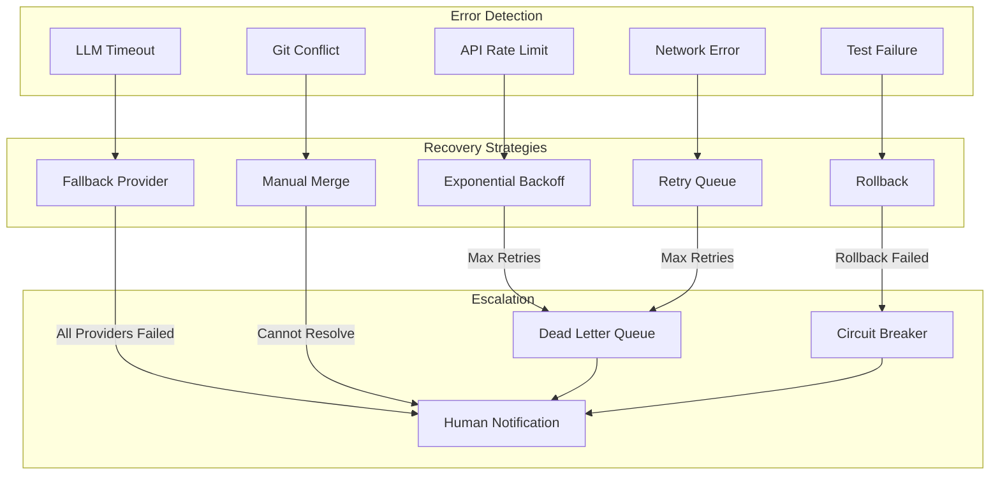

# Error Handling and Recovery

## Purpose
This diagram illustrates the comprehensive error handling and recovery mechanisms throughout the system. It shows how different types of failures are detected, categorized, and resolved to maintain system reliability and prevent cascading failures.

## What It Shows
- **Error Categories**: Different types of failures that can occur
- **Recovery Strategies**: Specific approaches for handling each error type
- **Escalation Paths**: When and how to escalate to human intervention
- **Circuit Breakers**: Protection mechanisms to prevent system overload

## Key Insights
- **Graceful Degradation**: System continues operating even when components fail
- **Automatic Recovery**: Many errors are resolved without human intervention
- **Failure Isolation**: Errors in one component don't bring down the entire system
- **Learning from Failures**: System adapts based on failure patterns

## Diagram



## Error Categories and Handling

### 1. API Rate Limiting Errors

#### Detection
- **GitHub API**: HTTP 429 responses with rate limit headers
- **LLM APIs**: Provider-specific rate limit responses
- **Monitoring**: Track rate limit usage across all APIs

#### Recovery Strategy: Exponential Backoff
```python
class ExponentialBackoffHandler:
    def __init__(self, max_retries=5, base_delay=1, max_delay=300):
        self.max_retries = max_retries
        self.base_delay = base_delay
        self.max_delay = max_delay
    
    async def retry_with_backoff(self, operation, *args, **kwargs):
        for attempt in range(self.max_retries):
            try:
                return await operation(*args, **kwargs)
            except RateLimitError as e:
                if attempt == self.max_retries - 1:
                    raise
                
                # Calculate delay: base_delay * 2^attempt + jitter
                delay = min(
                    self.base_delay * (2 ** attempt) + random.uniform(0, 1),
                    self.max_delay
                )
                
                # Use rate limit reset time if available
                if hasattr(e, 'reset_time'):
                    delay = max(delay, e.reset_time - time.time())
                
                await asyncio.sleep(delay)
        
        # If all retries exhausted, send to dead letter queue
        await self.send_to_dlq(operation, args, kwargs)
```

#### GitHub API Specific Handling
```python
def handle_github_rate_limit(response):
    if response.status_code == 429:
        reset_time = int(response.headers.get('X-RateLimit-Reset', 0))
        remaining = int(response.headers.get('X-RateLimit-Remaining', 0))
        
        if remaining == 0:
            # Primary rate limit hit
            wait_time = reset_time - time.time()
            return wait_time
        else:
            # Secondary rate limit (abuse detection)
            return 60  # Wait 1 minute for abuse detection cooldown
```

### 2. LLM Provider Timeouts

#### Detection
- **Timeout Errors**: Requests exceeding configured timeout
- **Provider Unavailability**: HTTP 5xx errors from LLM services
- **Performance Degradation**: Response times significantly above baseline

#### Recovery Strategy: Fallback Provider Chain
```python
class LLMProviderFailover:
    def __init__(self, providers):
        self.providers = providers  # Ordered by preference
        self.circuit_breakers = {p.name: CircuitBreaker() for p in providers}
    
    async def analyze_with_fallback(self, logs, context):
        for provider in self.providers:
            if self.circuit_breakers[provider.name].is_open():
                continue  # Skip providers that are down
            
            try:
                result = await asyncio.wait_for(
                    provider.analyze(logs, context),
                    timeout=30  # 30 second timeout
                )
                
                # Success - reset circuit breaker
                self.circuit_breakers[provider.name].record_success()
                return result
                
            except asyncio.TimeoutError:
                self.circuit_breakers[provider.name].record_failure()
                continue
            except Exception as e:
                self.circuit_breakers[provider.name].record_failure()
                if self.is_retryable_error(e):
                    continue
                else:
                    raise  # Don't retry non-retryable errors
        
        # All providers failed
        raise AllProvidersFailedError("No LLM provider available")
```

#### Circuit Breaker Implementation
```python
class CircuitBreaker:
    def __init__(self, failure_threshold=5, recovery_timeout=60):
        self.failure_threshold = failure_threshold
        self.recovery_timeout = recovery_timeout
        self.failure_count = 0
        self.last_failure_time = None
        self.state = 'CLOSED'  # CLOSED, OPEN, HALF_OPEN
    
    def is_open(self):
        if self.state == 'OPEN':
            if time.time() - self.last_failure_time > self.recovery_timeout:
                self.state = 'HALF_OPEN'
                return False
            return True
        return False
    
    def record_failure(self):
        self.failure_count += 1
        self.last_failure_time = time.time()
        
        if self.failure_count >= self.failure_threshold:
            self.state = 'OPEN'
    
    def record_success(self):
        self.failure_count = 0
        self.state = 'CLOSED'
```

### 3. Git Operation Conflicts

#### Detection
- **Merge Conflicts**: Git merge operations fail
- **Push Rejections**: Remote has newer commits
- **Lock Files**: Git repository locks preventing operations

#### Recovery Strategy: Conflict Resolution
```python
class GitConflictHandler:
    async def handle_push_rejection(self, repo, branch):
        try:
            # Strategy 1: Rebase on latest
            await repo.fetch()
            await repo.rebase(f'origin/{branch}')
            await repo.push()
            return True
            
        except GitConflictError:
            # Strategy 2: Try merge instead of rebase
            try:
                await repo.merge(f'origin/{branch}')
                await repo.push()
                return True
            except GitConflictError:
                # Strategy 3: Create new branch
                new_branch = f"{branch}-autofix-{int(time.time())}"
                await repo.checkout_new_branch(new_branch)
                await repo.push(new_branch)
                
                # Create PR for human resolution
                await self.create_conflict_resolution_pr(repo, branch, new_branch)
                return False
    
    async def handle_merge_conflict(self, repo, files_with_conflicts):
        resolvable_conflicts = []
        
        for file_path in files_with_conflicts:
            conflict_type = self.analyze_conflict(file_path)
            
            if conflict_type == 'whitespace_only':
                # Auto-resolve whitespace conflicts
                await self.resolve_whitespace_conflict(file_path)
                resolvable_conflicts.append(file_path)
            
            elif conflict_type == 'import_sorting':
                # Auto-resolve import order conflicts
                await self.resolve_import_conflict(file_path)
                resolvable_conflicts.append(file_path)
        
        if len(resolvable_conflicts) == len(files_with_conflicts):
            # All conflicts resolved
            await repo.add(resolvable_conflicts)
            await repo.commit("Resolve automatic merge conflicts")
            return True
        else:
            # Some conflicts need human intervention
            return False
```

### 4. Test Failure Handling

#### Detection
- **Test Suite Failures**: Exit code != 0 from test commands
- **Assertion Errors**: Specific test cases failing
- **Timeout Errors**: Tests taking too long to complete

#### Recovery Strategy: Rollback and Retry
```python
class TestFailureHandler:
    async def handle_test_failure(self, repo, test_results):
        # Analyze test failures
        failure_analysis = self.analyze_test_failures(test_results)
        
        if failure_analysis.is_flaky:
            # Retry flaky tests
            return await self.retry_flaky_tests(repo, failure_analysis.flaky_tests)
        
        elif failure_analysis.is_related_to_fix:
            # Our fix broke something - rollback
            await self.rollback_fix(repo)
            
            if failure_analysis.retry_count < self.max_retries:
                # Try alternative fix strategy
                alternative_fix = await self.generate_alternative_fix(failure_analysis)
                return await self.apply_alternative_fix(repo, alternative_fix)
            else:
                # Max retries reached - escalate
                await self.escalate_fix_failure(repo, failure_analysis)
                return False
        
        else:
            # Pre-existing test failures - not our problem
            return True  # Proceed despite pre-existing failures
    
    def analyze_test_failures(self, test_results):
        return TestFailureAnalysis(
            is_flaky=self.detect_flaky_tests(test_results),
            is_related_to_fix=self.is_failure_related_to_our_changes(test_results),
            flaky_tests=self.identify_flaky_tests(test_results),
            retry_count=self.get_retry_count()
        )
```

### 5. Network and Infrastructure Errors

#### Detection
- **Connection Timeouts**: Network requests timing out
- **DNS Resolution Failures**: Cannot resolve hostnames
- **Service Unavailability**: Dependencies returning errors

#### Recovery Strategy: Retry Queue with Circuit Breaker
```python
class NetworkErrorHandler:
    def __init__(self, redis_client):
        self.retry_queue = redis_client
        self.circuit_breakers = {}
    
    async def handle_network_error(self, operation, error):
        service_name = self.extract_service_name(operation)
        
        if service_name not in self.circuit_breakers:
            self.circuit_breakers[service_name] = CircuitBreaker()
        
        circuit_breaker = self.circuit_breakers[service_name]
        
        if circuit_breaker.is_open():
            # Service is down - queue for later
            await self.queue_for_retry(operation, delay=circuit_breaker.recovery_timeout)
        else:
            # Record failure and maybe open circuit
            circuit_breaker.record_failure()
            
            if self.is_retryable_error(error):
                await self.retry_with_exponential_backoff(operation)
            else:
                await self.escalate_to_human(operation, error)
```

## Dead Letter Queue Management

### DLQ Structure
```python
class DeadLetterQueue:
    def __init__(self, redis_client):
        self.redis = redis_client
        self.dlq_key = "dlq:failed_operations"
        self.retry_key = "dlq:retry_queue"
    
    async def send_to_dlq(self, operation, error, metadata=None):
        dlq_item = {
            'operation': serialize_operation(operation),
            'error': str(error),
            'timestamp': time.time(),
            'retry_count': metadata.get('retry_count', 0) if metadata else 0,
            'original_queue': metadata.get('original_queue') if metadata else None
        }
        
        await self.redis.lpush(self.dlq_key, json.dumps(dlq_item))
        
        # Alert humans if critical operation
        if self.is_critical_operation(operation):
            await self.send_critical_failure_alert(operation, error)
    
    async def process_dlq_items(self):
        """Periodic job to retry items from DLQ"""
        while True:
            item_json = await self.redis.brpop(self.dlq_key, timeout=60)
            if not item_json:
                continue
            
            item = json.loads(item_json[1])
            
            # Check if we should retry
            if self.should_retry(item):
                await self.retry_operation(item)
            else:
                await self.archive_failed_operation(item)
```

## Alerting and Escalation

### Human Notification Triggers
```python
class AlertManager:
    def __init__(self, notification_service):
        self.notification_service = notification_service
        self.alert_thresholds = {
            'error_rate': 0.1,  # 10% error rate
            'queue_depth': 1000,  # 1000 items in queue
            'response_time': 30,  # 30 second response time
            'cost_per_hour': 100  # $100/hour spend rate
        }
    
    async def check_alert_conditions(self, metrics):
        alerts = []
        
        if metrics.error_rate > self.alert_thresholds['error_rate']:
            alerts.append(HighErrorRateAlert(metrics.error_rate))
        
        if metrics.queue_depth > self.alert_thresholds['queue_depth']:
            alerts.append(QueueBacklogAlert(metrics.queue_depth))
        
        if metrics.avg_response_time > self.alert_thresholds['response_time']:
            alerts.append(SlowResponseAlert(metrics.avg_response_time))
        
        for alert in alerts:
            await self.send_alert(alert)
    
    async def send_alert(self, alert):
        message = self.format_alert_message(alert)
        
        if alert.severity == 'critical':
            await self.notification_service.send_immediate(message)
        else:
            await self.notification_service.send_batched(message)
```

### Alert Message Examples
```python
def format_alert_message(alert):
    if isinstance(alert, HighErrorRateAlert):
        return f"""
🚨 **CRITICAL: High Error Rate Detected**

Error Rate: {alert.error_rate:.1%} (threshold: 10%)
Time Window: Last 15 minutes
Affected Services: {', '.join(alert.affected_services)}

Recent Errors:
{format_recent_errors(alert.recent_errors)}

Dashboard: {alert.dashboard_url}
Runbook: {alert.runbook_url}
        """.strip()
    
    elif isinstance(alert, QueueBacklogAlert):
        return f"""
⚠️ **WARNING: Queue Backlog**

Queue Depth: {alert.queue_depth} items (threshold: 1000)
Estimated Processing Time: {alert.estimated_clear_time}
Affected Queues: {', '.join(alert.affected_queues)}

Possible Causes:
- Downstream service slowness
- Worker scaling needed
- High incoming load

Actions: Scale workers or investigate bottlenecks
        """.strip()
```

## Recovery Time Objectives

### Service Level Targets
| Error Type | Detection Time | Recovery Time | Manual Intervention |
|------------|----------------|---------------|-------------------|
| API Rate Limits | < 1 minute | 1-15 minutes | No |
| LLM Timeouts | < 30 seconds | < 5 minutes | No |
| Git Conflicts | Immediate | 2-10 minutes | Sometimes |
| Test Failures | < 2 minutes | 5-15 minutes | Sometimes |
| Network Errors | < 1 minute | 1-60 minutes | Rarely |

### Escalation Timeline
- **Immediate**: Critical security issues, data corruption
- **15 minutes**: All automated recovery attempts failed
- **1 hour**: Queue backlog affecting SLA
- **4 hours**: Persistent service degradation
- **24 hours**: Any unresolved issues

## Monitoring and Metrics

### Error Rate Metrics
```python
class ErrorMetrics:
    def __init__(self, metrics_client):
        self.metrics = metrics_client
    
    def record_error(self, component, error_type, severity):
        self.metrics.increment(
            'errors.total',
            tags={
                'component': component,
                'error_type': error_type,
                'severity': severity
            }
        )
    
    def record_recovery(self, component, recovery_method, duration):
        self.metrics.timing(
            'recovery.duration',
            duration,
            tags={
                'component': component,
                'method': recovery_method
            }
        )
```

### Health Check Endpoints
```python
@app.get("/health")
async def health_check():
    components = {
        'database': await check_database_health(),
        'queue': await check_queue_health(),
        'github_api': await check_github_api_health(),
        'llm_providers': await check_llm_providers_health()
    }
    
    overall_status = 'healthy' if all(
        status['status'] == 'healthy' 
        for status in components.values()
    ) else 'degraded'
    
    return {
        'status': overall_status,
        'timestamp': time.time(),
        'components': components
    }
```