# Monitoring and Dashboard Structure

## Purpose
This diagram shows the comprehensive monitoring strategy for the agentic coding workflow system. It illustrates what metrics to collect, how to organize dashboards, and when to trigger alerts to ensure system health and performance.

## What It Shows
- **Metrics Categories**: Business, technical, and cost metrics organization
- **Dashboard Layout**: How to structure monitoring dashboards for different audiences
- **Alert Hierarchy**: Priority levels and escalation paths for different issues
- **Observability Strategy**: Complete monitoring and troubleshooting approach

## Key Insights
- **Multi-Layered Monitoring**: Different metrics for different stakeholders
- **Proactive Alerting**: Catch issues before they become critical
- **Cost Visibility**: Track and control operational expenses
- **Performance Optimization**: Data-driven insights for improvements

## Diagram

```mermaid
graph TB
    subgraph "Business Metrics"
        M1[PRs Processed/Hour]
        M2[Fix Success Rate]
        M3[Review Turnaround Time]
        M4[Human Escalation Rate]
    end
    
    subgraph "Technical Metrics"
        T1[Worker CPU/Memory]
        T2[Queue Depth]
        T3[API Rate Limit Usage]
        T4[Database Query Time]
    end
    
    subgraph "Cost Metrics"
        C1[LLM API Costs]
        C2[Infrastructure Costs]
        C3[Cost per PR]
    end
    
    subgraph "Alerts"
        A1[Failed Checks > Threshold]
        A2[Queue Backlog]
        A3[Worker Down]
        A4[API Errors]
    end
    
    M1 --> DASH[Grafana Dashboard]
    M2 --> DASH
    M3 --> DASH
    M4 --> DASH
    T1 --> DASH
    T2 --> DASH
    T3 --> DASH
    T4 --> DASH
    C1 --> DASH
    C2 --> DASH
    C3 --> DASH
    
    A1 --> ALERT[PagerDuty]
    A2 --> ALERT
    A3 --> ALERT
    A4 --> ALERT
```



## Dashboard Structure

### Executive Dashboard
**Audience**: Leadership, Product Managers
**Update Frequency**: Daily/Weekly
**Key Metrics**:

```yaml
executive_metrics:
  business_value:
    - title: "Developer Productivity"
      metric: "time_saved_per_week"
      target: "40 hours/week"
      
    - title: "Code Quality Improvement"  
      metric: "issues_prevented_percentage"
      target: "85%"
      
    - title: "System ROI"
      metric: "cost_savings_vs_investment"
      target: "300%"
  
  operational_health:
    - title: "System Availability"
      metric: "uptime_percentage"
      target: "99.9%"
      
    - title: "Automation Rate"
      metric: "auto_resolved_percentage"
      target: "70%"
```

### Operations Dashboard
**Audience**: DevOps, SRE Teams
**Update Frequency**: Real-time
**Key Metrics**:

```yaml
operations_metrics:
  system_health:
    - title: "Worker Status"
      panels:
        - "monitor_worker_health"
        - "analyzer_worker_health" 
        - "fixer_worker_health"
        - "reviewer_worker_health"
    
    - title: "Queue Status"
      panels:
        - "queue_depth_by_type"
        - "message_processing_rate"
        - "queue_lag_time"
    
    - title: "External Dependencies"
      panels:
        - "github_api_health"
        - "llm_provider_health"
        - "claude_code_health"
  
  performance:
    - title: "Response Times"
      panels:
        - "pr_processing_time"
        - "analysis_duration"
        - "fix_application_time"
        - "review_completion_time"
    
    - title: "Error Rates"
      panels:
        - "error_rate_by_component"
        - "retry_attempts"
        - "dead_letter_queue_size"
```

### Development Dashboard  
**Audience**: Development Team
**Update Frequency**: Real-time
**Key Metrics**:

```yaml
development_metrics:
  code_quality:
    - title: "Fix Effectiveness"
      panels:
        - "fix_success_rate_by_category"
        - "false_positive_rate"
        - "time_to_resolution"
    
    - title: "Review Quality"
      panels:
        - "review_accuracy"
        - "human_agreement_rate"
        - "issues_caught_by_category"
  
  system_behavior:
    - title: "Decision Making"
      panels:
        - "auto_fix_vs_escalation_ratio"
        - "confidence_score_distribution"
        - "category_distribution"
    
    - title: "Learning Trends"
      panels:
        - "success_rate_improvements"
        - "pattern_recognition_accuracy"
```

## Detailed Metrics Definitions

### Business Metrics

#### PRs Processed per Hour
```python
class PRProcessingMetrics:
    def calculate_pr_throughput(self, time_window_hours=24):
        completed_prs = self.db.query("""
            SELECT COUNT(*) 
            FROM pull_requests 
            WHERE status IN ('merged', 'closed', 'approved')
            AND updated_at >= NOW() - INTERVAL %s HOUR
        """, [time_window_hours])
        
        return completed_prs / time_window_hours
    
    def calculate_processing_stages(self):
        return {
            'monitoring': self.avg_time_in_state('monitoring'),
            'analysis': self.avg_time_in_state('analyzing'), 
            'fixing': self.avg_time_in_state('fix_in_progress'),
            'review': self.avg_time_in_state('under_review')
        }
```

#### Fix Success Rate  
```python
def calculate_fix_success_rate(time_window_days=7):
    metrics = db.query("""
        SELECT 
            category,
            COUNT(*) as total_attempts,
            SUM(CASE WHEN status = 'succeeded' THEN 1 ELSE 0 END) as successful,
            SUM(CASE WHEN status = 'succeeded' THEN 1 ELSE 0 END) * 100.0 / COUNT(*) as success_rate
        FROM fix_attempts 
        WHERE created_at >= NOW() - INTERVAL %s DAY
        GROUP BY category
    """, [time_window_days])
    
    return {
        'overall': sum(m['successful'] for m in metrics) / sum(m['total_attempts'] for m in metrics),
        'by_category': {m['category']: m['success_rate'] for m in metrics}
    }
```

#### Human Escalation Rate
```python
def calculate_escalation_metrics():
    return {
        'escalation_rate': db.scalar("""
            SELECT COUNT(*) * 100.0 / (
                SELECT COUNT(*) FROM analysis_results 
                WHERE created_at >= NOW() - INTERVAL 24 HOUR
            )
            FROM analysis_results 
            WHERE decision = 'escalate_to_human'
            AND created_at >= NOW() - INTERVAL 24 HOUR
        """),
        
        'escalation_reasons': db.query("""
            SELECT reason, COUNT(*) as count
            FROM human_escalations
            WHERE created_at >= NOW() - INTERVAL 24 HOUR  
            GROUP BY reason
            ORDER BY count DESC
        """)
    }
```

### Technical Metrics

#### Queue Depth and Processing
```python
class QueueMetrics:
    def get_queue_status(self):
        return {
            queue_name: {
                'depth': self.redis.llen(f"queue:{queue_name}"),
                'processing_rate': self.get_processing_rate(queue_name),
                'avg_wait_time': self.get_avg_wait_time(queue_name),
                'dlq_depth': self.redis.llen(f"dlq:{queue_name}")
            }
            for queue_name in ['check.failed', 'fix.requested', 'pr.ready_for_review']
        }
    
    def get_processing_rate(self, queue_name, window_minutes=15):
        processed_count = self.redis.zcount(
            f"processed:{queue_name}",
            time.time() - (window_minutes * 60),
            time.time()
        )
        return processed_count / window_minutes  # items per minute
```

#### API Rate Limit Monitoring
```python
class APIMetrics:
    def get_rate_limit_status(self):
        github_limits = self.github_client.get_rate_limit()
        
        return {
            'github': {
                'core': {
                    'remaining': github_limits.core.remaining,
                    'limit': github_limits.core.limit,
                    'reset_time': github_limits.core.reset.timestamp(),
                    'usage_percentage': (1 - github_limits.core.remaining / github_limits.core.limit) * 100
                },
                'search': {
                    'remaining': github_limits.search.remaining,
                    'limit': github_limits.search.limit,
                    'usage_percentage': (1 - github_limits.search.remaining / github_limits.search.limit) * 100
                }
            },
            'llm_providers': {
                provider: self.get_provider_rate_limits(provider)
                for provider in ['openai', 'anthropic', 'google']
            }
        }
```

### Cost Metrics

#### LLM API Cost Tracking
```python
class CostMetrics:
    def calculate_llm_costs(self, time_window_hours=24):
        costs = db.query("""
            SELECT 
                provider,
                model,
                SUM(tokens_used) as total_tokens,
                SUM(cost_usd) as total_cost,
                COUNT(*) as request_count,
                AVG(cost_usd) as avg_cost_per_request
            FROM llm_usage 
            WHERE created_at >= NOW() - INTERVAL %s HOUR
            GROUP BY provider, model
        """, [time_window_hours])
        
        return {
            'total_cost': sum(c['total_cost'] for c in costs),
            'cost_per_hour': sum(c['total_cost'] for c in costs) / time_window_hours,
            'by_provider': self.group_by_provider(costs),
            'cost_per_pr': self.calculate_cost_per_pr(time_window_hours)
        }
    
    def calculate_cost_per_pr(self, time_window_hours):
        total_cost = self.calculate_llm_costs(time_window_hours)['total_cost']
        pr_count = db.scalar("""
            SELECT COUNT(*) FROM pull_requests 
            WHERE updated_at >= NOW() - INTERVAL %s HOUR
        """, [time_window_hours])
        
        return total_cost / pr_count if pr_count > 0 else 0
```

## Alert Configuration

### Alert Severity Levels

#### Critical Alerts (Immediate Response)
```yaml
critical_alerts:
  - name: "System Down"
    condition: "uptime < 95% for 5 minutes"
    notification: "pagerduty + slack + email"
    
  - name: "High Error Rate"
    condition: "error_rate > 20% for 10 minutes"
    notification: "pagerduty + slack"
    
  - name: "Queue Overflow"
    condition: "queue_depth > 5000 items"
    notification: "pagerduty + slack"
    
  - name: "Cost Spike"
    condition: "hourly_cost > $200 for 1 hour"
    notification: "pagerduty + email"
```

#### Warning Alerts (Business Hours Response)
```yaml
warning_alerts:
  - name: "Elevated Error Rate"
    condition: "error_rate > 10% for 15 minutes"
    notification: "slack"
    
  - name: "Queue Backlog"
    condition: "queue_depth > 1000 items for 30 minutes"
    notification: "slack"
    
  - name: "Slow Processing"
    condition: "avg_processing_time > 10 minutes for 30 minutes"
    notification: "slack"
    
  - name: "Low Fix Success Rate"
    condition: "fix_success_rate < 60% for 2 hours"
    notification: "slack + email"
```

#### Info Alerts (Daily Summary)
```yaml
info_alerts:
  - name: "Daily Summary"
    schedule: "daily at 9 AM"
    content: "PRs processed, costs, success rates"
    notification: "email"
    
  - name: "Weekly Performance Report"
    schedule: "weekly on Monday at 9 AM" 
    content: "Trends, optimizations, recommendations"
    notification: "email + slack"
```

### Alert Routing Rules
```python
class AlertRouter:
    def __init__(self):
        self.routing_rules = {
            'critical': ['pagerduty', 'slack-alerts', 'email-oncall'],
            'warning': ['slack-alerts', 'email-team'],
            'info': ['email-daily']
        }
        
        self.escalation_rules = {
            'critical': {
                'initial': 0,      # immediate
                'escalate_after': 15,  # 15 minutes
                'escalate_to': ['manager-email', 'director-phone']
            }
        }
    
    async def send_alert(self, alert):
        channels = self.routing_rules[alert.severity]
        
        for channel in channels:
            await self.send_to_channel(channel, alert)
        
        # Schedule escalation if critical
        if alert.severity == 'critical':
            await self.schedule_escalation(alert)
```

## Dashboard Panels Configuration

### Grafana Panel Examples

#### PR Processing Throughput
```json
{
  "title": "PR Processing Throughput",
  "type": "stat",
  "targets": [
    {
      "expr": "rate(prs_processed_total[1h])",
      "legendFormat": "PRs/hour"
    }
  ],
  "fieldConfig": {
    "defaults": {
      "unit": "short",
      "min": 0,
      "thresholds": {
        "steps": [
          {"color": "red", "value": 0},
          {"color": "yellow", "value": 10},
          {"color": "green", "value": 20}
        ]
      }
    }
  }
}
```

#### Queue Depth Visualization
```json
{
  "title": "Queue Depths",
  "type": "timeseries",
  "targets": [
    {
      "expr": "queue_depth{queue_name=~\".*\"}",
      "legendFormat": "{{queue_name}}"
    }
  ],
  "fieldConfig": {
    "defaults": {
      "custom": {
        "drawStyle": "line",
        "fillOpacity": 10
      }
    }
  }
}
```

#### Cost Breakdown
```json
{
  "title": "Cost by Provider (Last 24h)",
  "type": "piechart",
  "targets": [
    {
      "expr": "sum by (provider) (increase(llm_cost_usd_total[24h]))",
      "legendFormat": "{{provider}}"
    }
  ],
  "options": {
    "reduceOptions": {
      "calcs": ["lastNotNull"]
    }
  }
}
```

## Performance Benchmarks

### Target SLIs (Service Level Indicators)
```yaml
slis:
  availability: 99.9%
  pr_processing_time: 
    p50: "< 5 minutes"
    p95: "< 15 minutes"
    p99: "< 30 minutes"
  
  fix_success_rate: "> 75%"
  
  queue_processing:
    max_depth: 1000
    max_wait_time: "5 minutes"
  
  api_response_time:
    github: "< 2 seconds"
    llm: "< 30 seconds"
  
  cost_efficiency:
    cost_per_pr: "< $2.00"
    monthly_budget: "$10,000"
```

### Alerting on SLI Violations
```python
class SLIMonitor:
    def __init__(self, targets):
        self.targets = targets
        
    async def check_sli_compliance(self):
        violations = []
        
        # Check availability
        current_uptime = await self.get_uptime_percentage(24)
        if current_uptime < self.targets['availability']:
            violations.append(SLIViolation('availability', current_uptime, self.targets['availability']))
        
        # Check processing time
        p95_processing_time = await self.get_percentile_processing_time(95, 24)
        if p95_processing_time > parse_duration(self.targets['pr_processing_time']['p95']):
            violations.append(SLIViolation('processing_time_p95', p95_processing_time, self.targets['pr_processing_time']['p95']))
        
        return violations
```

## Custom Metrics Implementation

### Application Metrics
```python
from prometheus_client import Counter, Histogram, Gauge, start_http_server

# Business metrics
prs_processed = Counter('prs_processed_total', 'Total PRs processed', ['status', 'repository'])
fix_success_rate = Gauge('fix_success_rate', 'Current fix success rate', ['category'])
escalation_rate = Gauge('escalation_rate', 'Rate of human escalations')

# Technical metrics  
processing_time = Histogram('pr_processing_seconds', 'Time to process PR', ['stage'])
queue_depth = Gauge('queue_depth', 'Current queue depth', ['queue_name'])
api_calls = Counter('api_calls_total', 'API calls made', ['provider', 'status'])

# Cost metrics
llm_cost = Counter('llm_cost_usd_total', 'LLM API costs', ['provider', 'model'])
infrastructure_cost = Gauge('infrastructure_cost_usd_daily', 'Daily infrastructure cost')

class MetricsCollector:
    def record_pr_processed(self, status, repository):
        prs_processed.labels(status=status, repository=repository).inc()
    
    def record_processing_time(self, stage, duration):
        processing_time.labels(stage=stage).observe(duration)
    
    def update_queue_depth(self, queue_name, depth):
        queue_depth.labels(queue_name=queue_name).set(depth)
    
    def record_llm_cost(self, provider, model, cost):
        llm_cost.labels(provider=provider, model=model).inc(cost)
```

This comprehensive monitoring strategy ensures visibility into all aspects of the system, from business value delivery to technical performance and cost management.