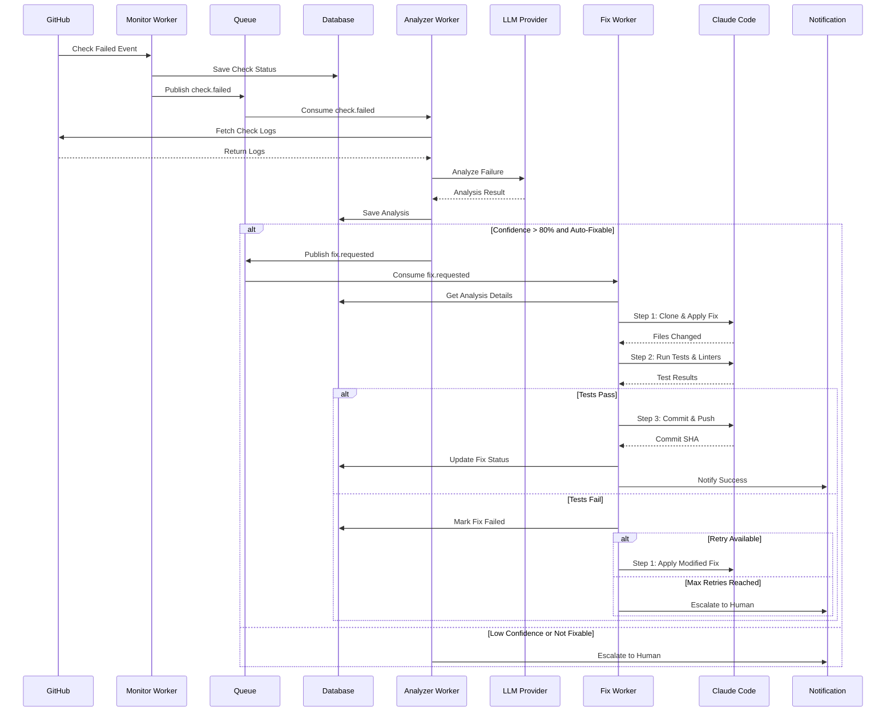
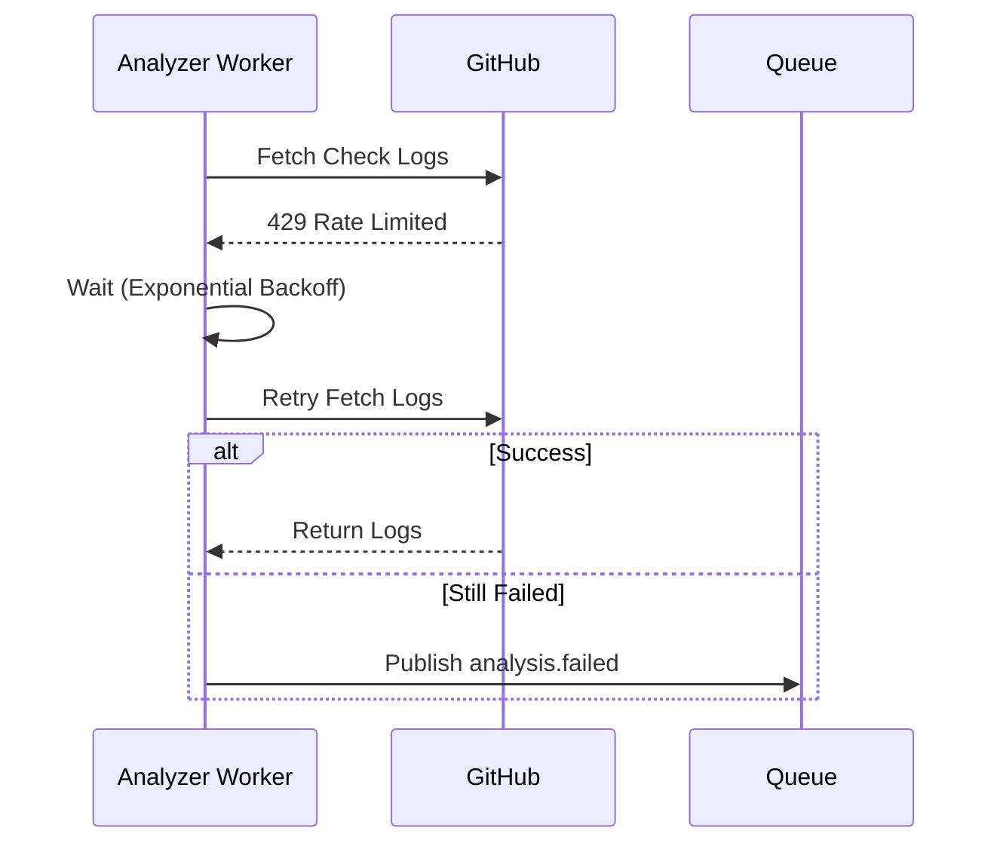
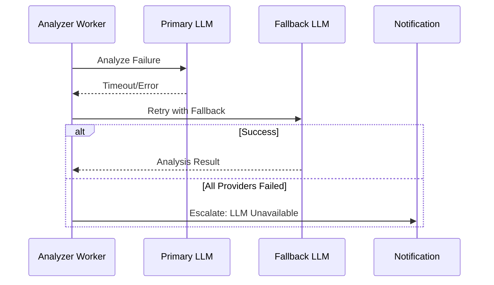
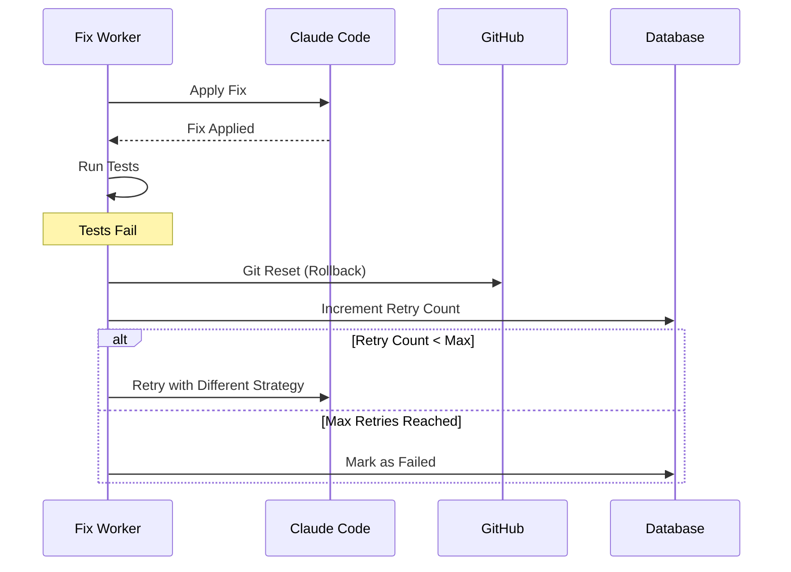

# Sequence Diagram: Failed Check to Fix

## Purpose
This sequence diagram shows the detailed step-by-step interaction between all system components when a check failure is detected and ultimately fixed automatically. It demonstrates the complete flow from failure detection to successful resolution.

## What It Shows
- **Component Interactions**: How different workers and services communicate
- **Timing**: The sequential order of operations
- **Decision Points**: Where the system makes routing decisions
- **External API Calls**: Interactions with GitHub, LLMs, and Claude Code
- **Error Paths**: What happens when things go wrong

## Key Insights
- **Async Processing**: Most communication happens through message queues
- **External Dependencies**: Heavy reliance on external APIs (GitHub, LLMs)
- **Validation Steps**: Multiple validation points before applying fixes
- **Notification Strategy**: Humans are informed of both successes and failures

## Diagram



## Detailed Sequence Breakdown

### Phase 1: Check Failure Detection (Steps 1-3)
1. **GitHub → Monitor Worker**: Check failure event (webhook or polling)
2. **Monitor Worker → Database**: Save check status and metadata
3. **Monitor Worker → Queue**: Publish `check.failed` event with PR and check details

### Phase 2: Log Analysis (Steps 4-8)
4. **Queue → Analyzer Worker**: Consume `check.failed` event
5. **Analyzer Worker → GitHub**: Fetch detailed check logs via API
6. **GitHub → Analyzer Worker**: Return raw log data
7. **Analyzer Worker → LLM Provider**: Send logs for intelligent analysis
8. **LLM Provider → Analyzer Worker**: Return structured analysis result
9. **Analyzer Worker → Database**: Persist analysis results for tracking

### Phase 3: Decision Routing (Step 9)
The analyzer evaluates the analysis result:
- **High Confidence + Auto-Fixable**: Proceed to automated fix
- **Low Confidence OR Not Auto-Fixable**: Escalate to human

### Phase 4A: Automated Fix Path (Steps 10-16)
10. **Analyzer Worker → Queue**: Publish `fix.requested` event
11. **Queue → Fix Worker**: Consume fix request with analysis context
12. **Fix Worker → Database**: Retrieve detailed analysis and PR information
13. **Fix Worker → Claude Code (Step 1)**: Clone PR branch and apply fix
14. **Claude Code → Fix Worker**: Return list of changed files
15. **Fix Worker → Claude Code (Step 2)**: Run tests and linters
16. **Claude Code → Fix Worker**: Return test results (pass/fail details)

### Phase 5A: Tests Pass Path (Steps 17-18)
17. **Fix Worker → Claude Code (Step 3)**: Commit, push, and update PR
    - **Claude Code → Fix Worker**: Return commit SHA and PR comment URL
18. **Fix Worker → Database**: Update fix attempt status as successful
    - **Fix Worker → Notification**: Notify stakeholders of successful fix

### Phase 5B: Tests Fail Path (Steps 19-20)
19. **Fix Worker → Database**: Mark fix attempt as failed
20. **Fix Worker Decision**:
    - **If retry_count < max**: Return to Step 13 with adapted strategy
    - **If max retries reached**: **Fix Worker → Notification**: Escalate to human with failure details

### Phase 4B: Human Escalation Path (Step 21)
21. **Analyzer Worker → Notification**: Send escalation alert with analysis

## Message Formats

### check.failed Event
```json
{
  "event_type": "check.failed",
  "pr_id": "uuid-123",
  "repository": "org/repo",
  "check_name": "ci/tests",
  "check_run_id": "12345",
  "failure_timestamp": "2024-01-15T10:30:00Z",
  "log_url": "https://api.github.com/repos/org/repo/check-runs/12345/logs"
}
```

### fix.requested Event
```json
{
  "event_type": "fix.requested",
  "pr_id": "uuid-123",
  "analysis_id": "uuid-456",
  "priority": "high",
  "estimated_complexity": "low",
  "files_to_modify": ["src/main.py", "tests/test_main.py"]
}
```

### notification.send Event
```json
{
  "event_type": "notification.send",
  "priority": "medium",
  "channel": "telegram",
  "message": "Successfully fixed linting issues in PR #123",
  "pr_url": "https://github.com/org/repo/pull/123",
  "details": {
    "fix_type": "automated",
    "issues_fixed": 3,
    "time_to_fix": "2m 34s"
  }
}
```

## Error Handling Scenarios

### GitHub API Failures


### LLM Provider Failures


### Fix Application Failures


## Performance Considerations

### Timing Expectations
- **Check Detection**: < 1 minute (polling interval)
- **Log Analysis**: 30-60 seconds (LLM response time)
- **Fix Application**: 2-5 minutes (clone, fix, test, push)
- **Total Time**: 3-7 minutes from failure to resolution

### Bottleneck Identification
- **LLM Response Time**: Largest variable in the pipeline
- **Git Operations**: Can be slow for large repositories
- **Test Execution**: Depends on test suite size and complexity

### Scalability Factors
- **Parallel Processing**: Multiple PRs can be processed simultaneously
- **Queue Depth**: Monitor for backlog buildup
- **Resource Limits**: Claude Code API rate limits may constrain throughput

## Monitoring Points

### Success Metrics
- **End-to-End Duration**: Time from failure to fix
- **Success Rate**: Percentage of fixes that work on first try
- **Component Performance**: Response times for each service

### Error Metrics
- **Failure Rates**: Track failures at each step
- **Retry Rates**: How often retries are needed
- **Escalation Rates**: How often human intervention is required

### Cost Metrics
- **LLM API Costs**: Per-analysis cost tracking
- **Claude Code Costs**: Per-fix cost tracking
- **Infrastructure Costs**: Queue and database usage