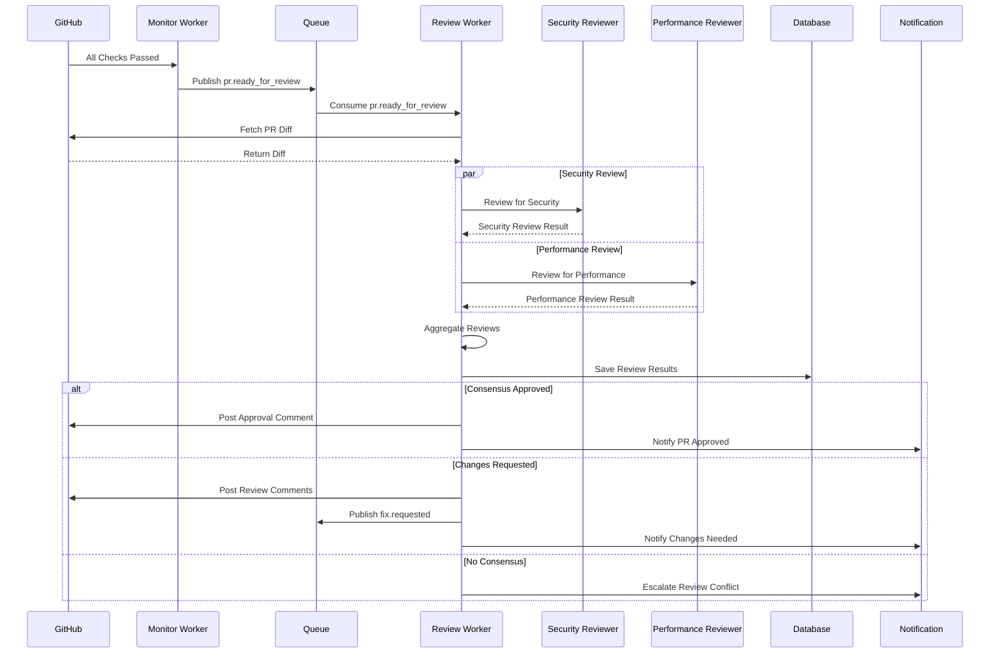
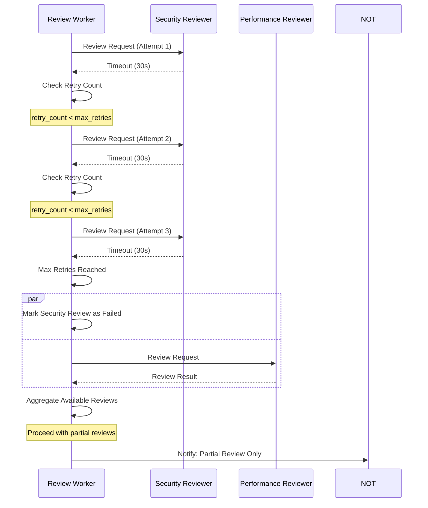
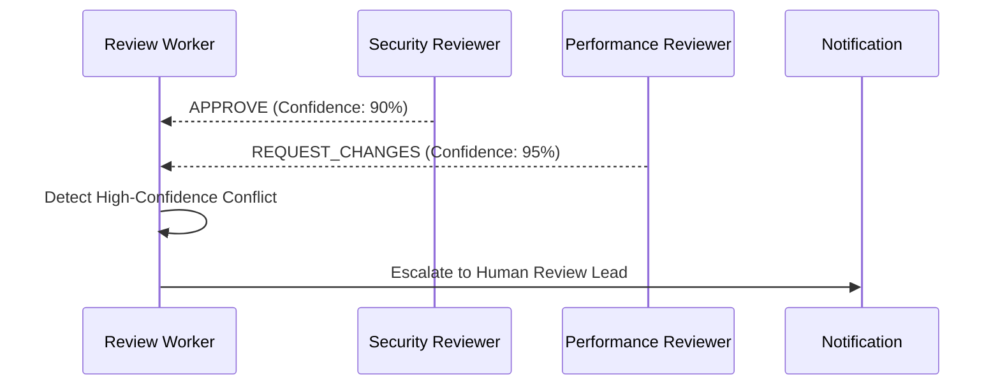

# Sequence Diagram: PR Review Process

## Purpose
This sequence diagram illustrates the complete multi-agent PR review process that occurs when all checks have passed. It shows how multiple specialized AI reviewers work in parallel and how their feedback is aggregated into actionable decisions.

## What It Shows
- **Parallel Review Execution**: Multiple reviewers analyzing simultaneously
- **Review Coordination**: How the orchestrator manages multiple reviewers
- **Decision Aggregation**: Process of combining multiple review results
- **Feedback Delivery**: How reviews are communicated back to developers
- **Follow-up Actions**: What happens after reviews are complete

## Key Insights
- **Concurrent Processing**: Reviews happen in parallel for speed
- **Specialized Expertise**: Each reviewer focuses on different aspects
- **Intelligent Aggregation**: Sophisticated logic for handling conflicts
- **Actionable Outcomes**: Reviews that can trigger automated fixes

## Diagram



## Detailed Sequence Breakdown

### Phase 1: Review Trigger (Steps 1-3)
1. **GitHub → Monitor Worker**: All checks pass notification
2. **Monitor Worker → Queue**: Publish `pr.ready_for_review` event
3. **Queue → Review Worker**: Consume review request

### Phase 2: Context Preparation (Steps 4-5)
4. **Review Worker → GitHub**: Fetch PR diff, file list, and metadata
5. **GitHub → Review Worker**: Return complete PR context

### Phase 3: Parallel Review Execution (Steps 6-9)
This phase runs in parallel for all configured reviewers:

**Security Review Branch:**
6. **Review Worker → Security Reviewer**: Send PR context with security focus
7. **Security Reviewer → Review Worker**: Return security analysis result

**Performance Review Branch:**
8. **Review Worker → Performance Reviewer**: Send PR context with performance focus
9. **Performance Reviewer → Review Worker**: Return performance analysis result

*Note: Additional reviewers (Code Quality, Documentation, etc.) would follow the same pattern*

### Phase 4: Review Aggregation (Steps 10-11)
10. **Review Worker → Review Worker**: Apply aggregation logic to combine results
11. **Review Worker → Database**: Save individual reviews and aggregated decision

### Phase 5: Action Based on Consensus (Steps 12-17)

**Approval Path (Steps 12-13):**
12. **Review Worker → GitHub**: Post approval comment with summary
13. **Review Worker → Notification**: Notify stakeholders of approval

**Changes Requested Path (Steps 14-16):**
14. **Review Worker → GitHub**: Post detailed review comments
15. **Review Worker → Queue**: Publish `fix.requested` for auto-fixable issues
16. **Review Worker → Notification**: Notify that changes are needed

**Escalation Path (Step 17):**
17. **Review Worker → Notification**: Escalate review conflict to humans

## Review Context Preparation

### PR Diff Analysis
```python
pr_context = {
    "files_changed": ["src/auth.py", "tests/test_auth.py"],
    "lines_added": 45,
    "lines_deleted": 12,
    "diff": "...",  # Full diff content
    "commit_messages": ["Add OAuth2 authentication"],
    "pr_description": "Implements OAuth2 flow for user authentication",
    "author": "developer@company.com",
    "reviewers_requested": ["@security-team"]
}
```

### Reviewer-Specific Context
```python
security_context = {
    **pr_context,
    "focus_areas": ["authentication", "authorization", "input_validation"],
    "security_checklist": [...],
    "previous_security_issues": [...]
}

performance_context = {
    **pr_context,
    "focus_areas": ["database_queries", "algorithm_complexity", "caching"],
    "performance_benchmarks": [...],
    "resource_usage_patterns": [...]
}
```

## Review Response Format

### Individual Review Structure
```json
{
  "reviewer": "Security Reviewer",
  "timestamp": "2024-01-15T10:30:00Z",
  "decision": "REQUEST_CHANGES",
  "confidence": 85,
  "summary": "Found potential security vulnerabilities in OAuth implementation",
  "comments": [
    {
      "type": "line",
      "severity": "critical",
      "file": "src/auth.py",
      "line": 42,
      "message": "Client secret should not be stored in plain text",
      "suggestion": "Use environment variables or secure vault",
      "category": "security.secrets",
      "auto_fixable": false
    },
    {
      "type": "line",
      "severity": "major",
      "file": "src/auth.py",
      "line": 67,
      "message": "Missing input validation for redirect_uri",
      "suggestion": "Add URL validation to prevent open redirects",
      "category": "security.validation",
      "auto_fixable": true
    }
  ],
  "metrics": {
    "files_reviewed": 2,
    "lines_reviewed": 145,
    "issues_found": 2,
    "review_duration": "45s"
  }
}
```

## Aggregation Logic Examples

### Weighted Consensus Algorithm
```python
def aggregate_reviews(reviews, config):
    total_weight = sum(config.reviewer_weights[r.reviewer] for r in reviews)
    
    # Calculate weighted approval score
    approval_score = 0
    for review in reviews:
        weight = config.reviewer_weights[review.reviewer]
        if review.decision == "APPROVE":
            approval_score += weight
        elif review.decision == "COMMENT":
            approval_score += weight * 0.5
    
    approval_rate = approval_score / total_weight
    
    # Check for critical issues
    critical_issues = [c for r in reviews for c in r.comments 
                      if c.severity == "critical"]
    
    if critical_issues:
        return "REQUEST_CHANGES"
    elif approval_rate >= 0.75:
        return "APPROVE"
    elif approval_rate >= 0.5:
        return "COMMENT"
    else:
        return "REQUEST_CHANGES"
```

### Security-First Algorithm
```python
def security_first_aggregate(reviews):
    security_reviews = [r for r in reviews if r.reviewer_type == "security"]
    
    # Security reviewer has veto power
    for review in security_reviews:
        if review.decision == "REQUEST_CHANGES":
            return "REQUEST_CHANGES"
    
    # If security approves, use majority rule for others
    other_reviews = [r for r in reviews if r.reviewer_type != "security"]
    approval_count = sum(1 for r in other_reviews if r.decision == "APPROVE")
    
    return "APPROVE" if approval_count > len(other_reviews) / 2 else "REQUEST_CHANGES"
```

## Comment Posting Strategies

### Aggregated Summary Comment
```markdown
## 🤖 Automated Code Review

**Overall Decision:** REQUEST CHANGES  
**Reviewers:** 3 specialized reviewers analyzed 5 files (234 lines)

### Summary by Category:
- 🔒 **Security:** 2 issues found (1 critical, 1 major)
- ⚡ **Performance:** 1 optimization opportunity  
- 📝 **Code Quality:** Approved

### Critical Issues Requiring Immediate Attention:
1. **Client secret exposure** (src/auth.py:42)
2. **Missing input validation** (src/auth.py:67)

### Detailed Comments:
*See individual line comments below for specific recommendations.*

---
*This review was generated by the Agentic Coding Workflow system*
```

### Individual Line Comments
Each issue gets posted as a separate GitHub PR review comment:
```markdown
🔒 **Security Issue - Critical**

Client secrets should never be stored in plain text. This creates a significant security vulnerability.

**Recommendation:** Store the client secret in an environment variable or secure configuration service.

```python
# Instead of:
client_secret = "abc123secret"

# Use:
client_secret = os.environ.get("OAUTH_CLIENT_SECRET")
```

*Detected by: Security Reviewer (Confidence: 95%)*

## Error Handling Scenarios

### Reviewer Timeout with Retry


**Implementation Example:**
```python
async def execute_review_with_retry(reviewer_config, pr_context, max_retries=3):
    """
    Execute a single reviewer with configurable retry logic for timeouts.
    """
    retry_count = 0
    timeout = reviewer_config.timeout_seconds
    
    while retry_count < max_retries:
        try:
            # Attempt review with timeout
            result = await asyncio.wait_for(
                execute_single_review(reviewer_config, pr_context),
                timeout=timeout
            )
            return result
            
        except asyncio.TimeoutError:
            retry_count += 1
            
            if retry_count < max_retries:
                # Exponential backoff for retries
                wait_time = 2 ** retry_count
                logger.warning(
                    f"Reviewer {reviewer_config.name} timeout (attempt {retry_count}/{max_retries}). "
                    f"Retrying in {wait_time}s..."
                )
                await asyncio.sleep(wait_time)
                
                # Optionally increase timeout for retry
                timeout = min(timeout * 1.5, 60)  # Cap at 60 seconds
            else:
                logger.error(f"Reviewer {reviewer_config.name} failed after {max_retries} attempts")
                return {
                    'reviewer': reviewer_config.name,
                    'status': 'failed',
                    'reason': 'timeout_after_retries',
                    'attempts': max_retries
                }

async def handle_partial_reviews(available_reviews, failed_reviewers, pr_context):
    """
    Handle the case where some reviewers failed and we're proceeding with partial reviews.
    Notify humans about the incomplete review coverage.
    """
    if failed_reviewers:
        failed_names = [r['reviewer'] for r in failed_reviewers]
        notification_message = {
            'priority': 'medium',
            'message': f"PR #{pr_context.pr_number} reviewed with incomplete coverage",
            'details': {
                'pr_url': pr_context.pr_url,
                'failed_reviewers': failed_names,
                'available_reviewers': [r.reviewer for r in available_reviews],
                'impact': f"Missing {len(failed_reviewers)} out of {len(failed_reviewers) + len(available_reviews)} reviewers"
            }
        }
        
        await notification_service.send(notification_message)
        logger.warning(f"Proceeding with partial review for PR {pr_context.pr_number}. "
                      f"Failed reviewers: {', '.join(failed_names)}")
    
    return await aggregate_reviews(available_reviews)
```

### Review Conflict Resolution


## Performance Optimizations

### Parallel Review Execution
- **Concurrent API Calls**: All reviewers work simultaneously
- **Timeout Management**: Don't wait for slow reviewers
- **Resource Pooling**: Reuse LLM connections

### Context Optimization
- **Diff Filtering**: Only send relevant code sections to each reviewer
- **Caching**: Cache expensive operations like file analysis
- **Batching**: Group related files for more efficient review

### Cost Management
- **Smart Routing**: Skip expensive reviewers for trivial changes
- **Budget Limits**: Stop reviews if cost thresholds exceeded
- **Model Selection**: Use appropriate models for different review types

## Quality Metrics

### Review Accuracy
- **Human Agreement Rate**: How often humans agree with AI decisions
- **False Positive Rate**: Issues flagged incorrectly
- **False Negative Rate**: Real issues missed

### Review Coverage
- **Code Coverage**: Percentage of changed code actually reviewed
- **Issue Detection Rate**: How many known issue types are caught
- **Comment Quality**: Usefulness of suggestions provided

### Efficiency Metrics
- **Review Speed**: Time from trigger to completion
- **Cost per Review**: LLM API costs per PR reviewed
- **Reviewer Utilization**: How effectively each reviewer is used