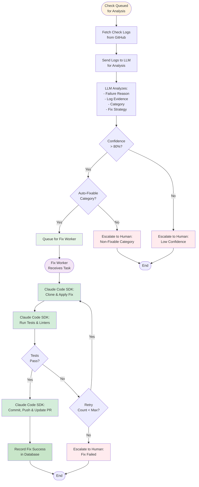

# Check Analysis and Fixing Workflow

## Purpose
This diagram illustrates the complete process from check failure detection to automated fix application. It shows how the system uses AI to analyze failures, decide on fix strategies, and apply fixes using Claude Code SDK.

## What It Shows
- **Analysis Pipeline**: How failed check logs are processed by LLMs
- **Decision Making**: Logic for determining if issues can be auto-fixed
- **Fix Application**: The complete fix workflow using Claude Code
- **Validation Process**: How fixes are tested before being applied
- **Fallback Mechanisms**: What happens when fixes fail

## Key Insights
- **AI-Driven Analysis**: LLMs provide intelligent failure categorization
- **Confidence-Based Decisions**: Only high-confidence fixes are automated
- **Safety First**: Extensive validation before applying fixes
- **Human Escalation**: Clear paths for cases that need human intervention

## Diagram



## Analysis Phase Explained

### 1. Log Fetching
- **Multiple Sources**: GitHub Actions, CircleCI, Jenkins logs
- **Log Parsing**: Extract relevant error information
- **Context Collection**: Gather related files and configuration

### 2. LLM Analysis
- **Provider Selection**: Use configured LLM (OpenAI, Anthropic, etc.)
- **Prompt Engineering**: Structured prompts for consistent analysis
- **Output Parsing**: Extract structured data from LLM responses

### 3. Analysis Components
```json
{
  "category": "test|lint|compile|deploy|infra",
  "root_cause": "Description of the issue",
  "confidence": 85,
  "evidence": ["log line 1", "log line 2"],
  "fix_strategy": {
    "approach": "Description of fix",
    "complexity": "low|medium|high",
    "files_affected": ["file1.py", "file2.py"]
  }
}
```

### 4. Decision Logic
- **Confidence Threshold**: Only proceed if confidence > 80%
- **Category Filtering**: Only certain categories are auto-fixable
- **Complexity Assessment**: Simple fixes get priority
- **Risk Assessment**: Security-related issues always escalate

## Auto-Fixable Categories

### High Success Rate
- **Linting Issues**: Code formatting, import sorting
- **Simple Test Failures**: Assertion updates, mock fixes
- **Dependency Updates**: Version bumps, compatibility fixes

### Medium Success Rate
- **Compilation Errors**: Missing imports, syntax fixes
- **Type Errors**: Type annotation fixes
- **Configuration Issues**: Config file updates

### Never Auto-Fixed
- **Security Vulnerabilities**: Always require human review
- **Infrastructure Failures**: Beyond code-level fixes
- **Complex Logic Errors**: Require domain knowledge

## Fix Application Phase

### 1. Claude Code SDK Three-Step Process
The Fix Worker orchestrates three separate Claude Code SDK calls for better control and feedback:

#### Step 1: Clone & Apply Fix
```python
async def claude_apply_fix(analysis_result, pr_context):
    """
    First Claude Code call: Clone repository and apply the fix.
    """
    response = await claude_code_sdk.execute({
        'action': 'apply_fix',
        'pr_url': pr_context.pr_url,
        'branch': pr_context.branch,
        'instructions': f"""
        Clone the PR branch and apply fix for: {analysis_result.root_cause}
        Based on analysis: {analysis_result.fix_strategy}
        
        Return the list of files modified and changes made.
        """
    })
    
    return {
        'success': response.success,
        'files_changed': response.files_changed,
        'changes_summary': response.changes_summary
    }
```

#### Step 2: Run Tests & Linters
```python
async def claude_run_tests(pr_context):
    """
    Second Claude Code call: Run tests and linters to validate the fix.
    This is where we get the critical feedback on whether the fix works.
    """
    response = await claude_code_sdk.execute({
        'action': 'run_tests',
        'working_directory': pr_context.working_dir,
        'instructions': f"""
        Run the following validation:
        1. Run tests: {pr_context.test_command}
        2. Run linter: {pr_context.lint_command}
        3. Run type checker: {pr_context.typecheck_command}
        
        Return detailed results for each step.
        """
    })
    
    return {
        'tests_passed': response.tests.passed,
        'test_output': response.tests.output,
        'failed_tests': response.tests.failed_list,
        'lint_passed': response.lint.passed,
        'lint_errors': response.lint.errors,
        'typecheck_passed': response.typecheck.passed,
        'all_passed': response.tests.passed and response.lint.passed
    }
```

#### Step 3: Commit, Push & Update PR
```python
async def claude_commit_and_push(pr_context, fix_summary):
    """
    Third Claude Code call: Only executed if tests pass.
    Commits changes, pushes to GitHub, and updates PR description.
    """
    response = await claude_code_sdk.execute({
        'action': 'commit_and_push',
        'working_directory': pr_context.working_dir,
        'instructions': f"""
        1. Commit changes with message: "Fix: {fix_summary}"
        2. Push to branch: {pr_context.branch}
        3. Add PR comment explaining:
           - What was broken
           - How it was fixed
           - Tests that now pass
        
        Return commit SHA and PR comment URL.
        """
    })
    
    return {
        'commit_sha': response.commit_sha,
        'pr_comment_url': response.pr_comment_url,
        'push_success': response.push_success
    }
```

### 2. Orchestration Logic
```python
async def orchestrate_fix(analysis_result, pr_context):
    """
    Main orchestration logic using the three-step process.
    """
    retry_count = 0
    max_retries = 3
    
    while retry_count < max_retries:
        # Step 1: Apply the fix
        apply_result = await claude_apply_fix(analysis_result, pr_context)
        if not apply_result['success']:
            return escalate_to_human("Failed to apply fix")
        
        # Step 2: Run tests - THIS IS WHERE WE GET FEEDBACK
        test_result = await claude_run_tests(pr_context)
        
        if test_result['all_passed']:
            # Step 3: Tests passed, commit and push
            commit_result = await claude_commit_and_push(
                pr_context, 
                apply_result['changes_summary']
            )
            
            if commit_result['push_success']:
                return record_success(commit_result)
            else:
                return escalate_to_human("Push failed")
        
        else:
            # Tests failed - analyze and potentially retry
            retry_count += 1
            
            if retry_count < max_retries:
                # Modify strategy based on test failure
                analysis_result = adapt_fix_strategy(
                    analysis_result,
                    test_result['test_output'],
                    test_result['lint_errors']
                )
            else:
                return escalate_to_human(f"Fix failed after {max_retries} attempts")
```

### 3. Retry Logic with Claude Code
```python
async def handle_claude_code_failure(result, retry_count):
    if result['status'] == 'tests_failed':
        # Analyze test output to guide retry
        test_analysis = analyze_test_failures(result['test_output'])
        
        if test_analysis.suggests_different_approach:
            # Retry with modified strategy
            new_instructions = generate_alternative_fix_strategy(test_analysis)
            return await invoke_claude_code_fix(new_instructions)
    
    elif result['status'] == 'lint_failed':
        # Retry with explicit lint fixing instructions
        lint_fix_instructions = f"Fix linting issues: {result['lint_errors']}"
        return await invoke_claude_code_fix(lint_fix_instructions)
    
    # If can't retry, escalate to human
    return escalate_to_human(result)
```

## Error Handling and Recovery

### Analysis Failures
- **LLM Timeouts**: Retry with exponential backoff
- **API Rate Limits**: Queue for later processing
- **Invalid Responses**: Log and escalate to human

### Fix Application Failures
- **Git Conflicts**: Attempt auto-resolution or escalate
- **Test Failures**: Rollback and try alternative approach
- **Permission Errors**: Check repository access and escalate

### Rollback Mechanisms
- **Git Reset**: Revert to original state
- **Branch Cleanup**: Remove temporary fix branches
- **Status Updates**: Mark fix attempt as failed

## Metrics and Monitoring

### Success Metrics
- **Fix Success Rate**: Percentage of fixes that work on first try
- **Category Accuracy**: How often categorization is correct
- **Time to Fix**: Average time from failure to resolution

### Quality Metrics
- **False Positive Rate**: Fixes that break other things
- **Human Override Rate**: How often humans need to intervene
- **Confidence Calibration**: How well confidence scores predict success

### Cost Metrics
- **LLM API Costs**: Cost per analysis
- **Claude Code Usage**: Cost per fix attempt
- **Infrastructure Costs**: Compute resources for validation