# PR Monitoring Workflow

## Purpose
This diagram shows the complete workflow of the implemented PR Monitor Worker, which uses a three-phase processing pipeline to efficiently discover, analyze, and synchronize pull request data from GitHub to the database.

## What It Shows
- **Three-Phase Pipeline**: Discovery → Change Detection → Synchronization
- **Orchestrated Processing**: How the DefaultPRProcessor coordinates all phases
- **Error Handling**: How failures in each phase are managed and tracked
- **Concurrency Management**: How multiple repositories are processed in parallel

## Key Insights
- **Service-Oriented Architecture**: Each phase uses dedicated services with clear interfaces
- **Transactional Consistency**: Database changes are atomic and isolated
- **Performance Optimization**: Bulk operations and concurrent processing
- **Comprehensive Metrics**: Detailed tracking of processing results and errors

## Diagram

```mermaid
flowchart TD
    START([PR Processor<br/>Start]) --> INIT[Initialize Services<br/>Discovery, ChangeDetector, Synchronizer]
    
    INIT --> PROCESS_REPO[Process Repository]
    PROCESS_REPO --> DISCOVERY_PHASE[Phase 1: Discovery]
    
    DISCOVERY_PHASE --> GITHUB_API[GitHub API<br/>Fetch PRs & Check Runs]
    GITHUB_API --> ETAG_CACHE{ETag Cache<br/>Hit?}
    
    ETAG_CACHE -->|Yes| CACHED_DATA[Use Cached Data]
    ETAG_CACHE -->|No| PAGINATE[Paginate API Results<br/>With Rate Limiting]
    
    CACHED_DATA --> DISCOVERY_METRICS[Record Discovery Metrics<br/>PRs & Check Runs Count]
    PAGINATE --> DISCOVERY_METRICS
    
    DISCOVERY_METRICS --> CHANGE_PHASE[Phase 2: Change Detection]
    
    CHANGE_PHASE --> DB_QUERY[Query Database<br/>for Existing PRs/Checks]
    DB_QUERY --> COMPARE_DATA[Compare GitHub Data<br/>with Database State]
    
    COMPARE_DATA --> DETECT_CHANGES[Detect Changes<br/>New, Updated, State Changes]
    DETECT_CHANGES --> CREATE_CHANGESET[Create ChangeSet<br/>with All Detected Changes]
    
    CREATE_CHANGESET --> SYNC_PHASE[Phase 3: Synchronization]
    
    SYNC_PHASE --> BEGIN_TX[Begin Database<br/>Transaction]
    BEGIN_TX --> BULK_CREATE[Bulk Create<br/>New PRs]
    
    BULK_CREATE --> BULK_UPDATE[Bulk Update<br/>Existing PRs]
    BULK_UPDATE --> CREATE_CHECKS[Create New<br/>Check Runs]
    
    CREATE_CHECKS --> UPDATE_CHECKS[Update Existing<br/>Check Runs]
    UPDATE_CHECKS --> STATE_HISTORY[Update State<br/>History Records]
    
    STATE_HISTORY --> COMMIT_TX[Commit<br/>Transaction]
    COMMIT_TX --> UPDATE_METRICS[Update Processing<br/>Metrics & Repository Tracking]
    
    UPDATE_METRICS --> CHECK_SUCCESS{Processing<br/>Successful?}
    
    CHECK_SUCCESS -->|Yes| RESET_FAILURE[Reset Repository<br/>Failure Count]
    CHECK_SUCCESS -->|No| INCREMENT_FAILURE[Increment Repository<br/>Failure Count]
    
    RESET_FAILURE --> END_SUCCESS([End: Success])
    INCREMENT_FAILURE --> LOG_ERROR[Log Errors &<br/>Update Tracking]
    
    LOG_ERROR --> END_ERROR([End: With Errors])
    
    %% Error paths
    GITHUB_API -->|API Error| DISCOVERY_ERROR[Record Discovery<br/>Error]
    COMPARE_DATA -->|DB Error| CHANGE_ERROR[Record Change<br/>Detection Error]
    BEGIN_TX -->|TX Error| SYNC_ERROR[Record Sync<br/>Error & Rollback]
    
    DISCOVERY_ERROR --> INCREMENT_FAILURE
    CHANGE_ERROR --> INCREMENT_FAILURE
    SYNC_ERROR --> INCREMENT_FAILURE
    
    %% Concurrent processing
    PROCESS_REPO --> BATCH_PROCESS{Batch<br/>Processing?}
    BATCH_PROCESS -->|Yes| SEMAPHORE[Apply Concurrency<br/>Semaphore]
    BATCH_PROCESS -->|No| DISCOVERY_PHASE
    SEMAPHORE --> DISCOVERY_PHASE
    
    style START fill:#e1f5fe
    style DISCOVERY_PHASE fill:#e8f5e8
    style CHANGE_PHASE fill:#fff3e0
    style SYNC_PHASE fill:#fce4ec
    style END_SUCCESS fill:#e8f5e8
    style END_ERROR fill:#ffebee
```



## Workflow Steps Explained

### 1. Service Initialization
- **Dependency Injection**: Creates discovery, change detection, and synchronization services
- **Configuration**: Applies concurrency limits and performance settings
- **Database Connections**: Establishes repository pattern connections

### 2. Discovery Phase (GitHub API)
- **PR Discovery Service**: GitHubPRDiscoveryService fetches PRs using GitHub API
- **ETag Caching**: Conditional requests with If-None-Match headers to minimize API calls
- **Pagination**: Handles large result sets with automatic pagination
- **Rate Limiting**: Respects GitHub API limits with semaphore-based throttling
- **Check Run Discovery**: Fetches check runs for PR head commits
- **Concurrent Processing**: Batch processes multiple PRs in parallel
- **Error Isolation**: Individual PR failures don't stop batch processing

### 3. Change Detection Phase (Database Comparison)
- **Database Change Detector**: Compares GitHub data with stored database state
- **Granular Tracking**: Detects specific field changes:
  - Title changes
  - State transitions (opened → closed → merged)
  - Draft status changes
  - SHA changes (new commits)
  - Metadata changes (labels, assignees, milestones)
- **Bulk Queries**: Efficiently queries database for existing PRs and check runs
- **Relationship Mapping**: Links check runs to correct PR records
- **Change Categorization**: Organizes changes into new vs. updated entities

### 4. Synchronization Phase (Database Updates)
- **Transactional Processing**: Wraps all changes in database transactions
- **Bulk Operations**: Uses PostgreSQL UPSERT for performance:
  - Bulk PR creation with conflict resolution
  - Bulk check run insertion
  - Batch updates for existing records
- **State History**: Maintains audit trail of PR state transitions
- **Error Recovery**: Automatic rollback on failures to maintain data integrity
- **Relationship Consistency**: Ensures foreign key relationships are maintained

### 5. Error Handling and Recovery
- **Phase-Level Isolation**: Errors in one phase don't affect others
- **Repository Tracking**: Maintains failure count and last success timestamp per repository
- **Comprehensive Logging**: Structured logging with correlation IDs
- **Metrics Collection**: Tracks processing times, success rates, and error patterns
- **Retry Logic**: Built into GitHub client for transient failures

### 6. Concurrent Processing Management
- **Semaphore Control**: Limits concurrent repository processing to prevent resource exhaustion
- **Batch Processing**: ProcessRepositories method handles multiple repos efficiently
- **Error Isolation**: Individual repository failures don't affect others in batch
- **Resource Management**: Proper cleanup and connection management

### 7. Performance Optimization
- **Bulk Database Operations**: Minimizes database round trips
- **API Caching**: ETag-based conditional requests
- **Concurrent GitHub Requests**: Parallel processing within rate limits
- **Connection Pooling**: Reuses database connections efficiently

## Configuration Options

### Repository Settings
```yaml
repositories:
  - url: "https://github.com/org/repo"
    skip_patterns:
      pr_labels: ["wip", "draft", "dependencies"]
      check_names: ["codecov/*", "license/*"]
      authors: ["dependabot[bot]"]
    failure_threshold: 5
    polling_interval: 300
```

### Skip Pattern Examples
- **PR Labels**: Skip PRs with certain labels
- **Check Names**: Ignore specific CI checks
- **Authors**: Exclude automated PR creators
- **File Patterns**: Skip PRs touching only certain files

## Error Handling

### GitHub API Failures
- **Rate Limiting**: Exponential backoff and retry
- **Network Errors**: Temporary failure handling
- **Authentication**: Token refresh mechanisms

### Database Failures
- **Connection Pooling**: Maintain database connectivity
- **Transaction Rollback**: Ensure data consistency
- **Deadlock Handling**: Retry logic for concurrent updates

### Queue Failures
- **Message Persistence**: Ensure events aren't lost
- **Dead Letter Queues**: Handle unprocessable messages
- **Circuit Breakers**: Stop publishing when queue is down