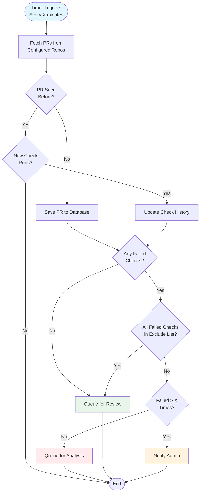

# PR Monitoring Workflow

## Purpose
This diagram shows the complete workflow of how the PR Monitor Worker discovers, tracks, and categorizes pull requests. It demonstrates the decision logic that determines whether a PR should be analyzed, reviewed, or escalated to humans.

## What It Shows
- **Periodic Polling**: How the system regularly checks for PR updates
- **State Management**: How the system tracks what it has seen before
- **Decision Logic**: Rules for determining next actions
- **Escalation Triggers**: When human intervention is required

## Key Insights
- **Stateful Processing**: The system remembers what it has seen to avoid duplicate work
- **Configurable Filtering**: Skip patterns allow customization of what gets processed
- **Threshold-Based Escalation**: Repeated failures trigger human notification
- **Branching Logic**: Different paths for new vs. existing PRs

## Diagram



## Workflow Steps Explained

### 1. Trigger (Timer-Based)
- **Frequency**: Configurable interval (default: 5 minutes)
- **Purpose**: Ensures regular polling without overwhelming GitHub API
- **Scalability**: Can be adjusted based on repository activity

### 2. PR Fetching
- **Source**: GitHub API for configured repositories
- **Data Retrieved**: PR metadata, current status, check runs
- **Filtering**: Applied at fetch time to reduce processing overhead

### 3. State Tracking Decision
- **Database Lookup**: Check if PR exists in local database
- **New PRs**: Full processing pipeline
- **Existing PRs**: Only process if there are changes

### 4. Change Detection
- **Check Run Comparison**: Compare current check runs with last known state
- **Timestamp Tracking**: Use last_checked timestamp for efficiency
- **State Changes**: Detect transitions in PR status

### 5. Check Evaluation
- **Failure Detection**: Identify which checks have failed
- **Success Handling**: Route successful PRs to review queue
- **Status Filtering**: Only process completed (not running) checks

### 6. Exclusion Filtering
- **All Failed Checks Excluded**: If ALL failed checks are in the exclude list, treat as successful
- **Partial Exclusion**: If only some failed checks are excluded, proceed with failure handling
- **Skip Patterns**: Configurable patterns to exclude certain checks
- **Examples**: 
  - Dependabot PRs
  - Draft PRs  
  - Specific check types (codecov, etc.)

### 7. Threshold Check (Before Analysis)
- **Failure Counting**: Track consecutive failures per repository/check type
- **Escalation Decision**: Check threshold BEFORE queuing for analysis
- **Admin Notification**: Alert humans when threshold exceeded - bypass analysis
- **Purpose**: Catch systemic issues that automation can't handle

### 8. Queue Routing
- **Analysis Queue**: Failed checks that need LLM analysis (only if under threshold)
- **Review Queue**: Successful PRs or PRs with all failures excluded
- **Event Publishing**: Async messaging to downstream workers

## Configuration Options

### Repository Settings
```yaml
repositories:
  - url: "https://github.com/org/repo"
    skip_patterns:
      pr_labels: ["wip", "draft", "dependencies"]
      check_names: ["codecov/*", "license/*"]
      authors: ["dependabot[bot]"]
    failure_threshold: 5
    polling_interval: 300
```

### Skip Pattern Examples
- **PR Labels**: Skip PRs with certain labels
- **Check Names**: Ignore specific CI checks
- **Authors**: Exclude automated PR creators
- **File Patterns**: Skip PRs touching only certain files

## Error Handling

### GitHub API Failures
- **Rate Limiting**: Exponential backoff and retry
- **Network Errors**: Temporary failure handling
- **Authentication**: Token refresh mechanisms

### Database Failures
- **Connection Pooling**: Maintain database connectivity
- **Transaction Rollback**: Ensure data consistency
- **Deadlock Handling**: Retry logic for concurrent updates

### Queue Failures
- **Message Persistence**: Ensure events aren't lost
- **Dead Letter Queues**: Handle unprocessable messages
- **Circuit Breakers**: Stop publishing when queue is down