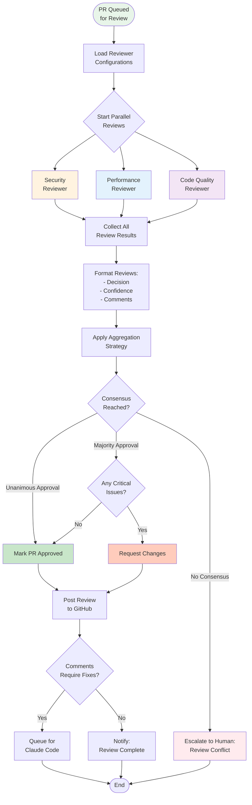

# PR Review Workflow

## Purpose
This diagram shows how the multi-agent review system works when all PR checks have passed. It demonstrates how multiple AI reviewers analyze the code independently and how their feedback is aggregated into actionable decisions.

## What It Shows
- **Parallel Review Execution**: Multiple reviewers working simultaneously
- **Review Aggregation**: How individual reviews are combined
- **Decision Logic**: Rules for determining final review outcomes
- **Feedback Mechanisms**: How reviews are communicated back to developers

## Key Insights
- **Specialized Reviewers**: Each reviewer focuses on specific aspects (security, performance, etc.)
- **Consensus Building**: Sophisticated logic for handling conflicting opinions
- **Human Escalation**: Clear rules for when human input is needed
- **Actionable Feedback**: Reviews that can trigger automatic fixes

## Diagram



## Reviewer Configuration

### Example Reviewer Setup
```yaml
reviewers:
  - name: "Security Reviewer"
    provider: "openai"
    model: "gpt-4"
    focus_areas: ["authentication", "authorization", "input_validation", "crypto"]
    prompt_template: "security_review.txt"
    weight: 2  # Higher weight for security issues
    
  - name: "Performance Reviewer"
    provider: "anthropic"
    model: "claude-3-opus"
    focus_areas: ["algorithms", "database", "caching", "scalability"]
    prompt_template: "performance_review.txt"
    weight: 1
    
  - name: "Code Quality Reviewer"
    provider: "openai"
    model: "gpt-4"
    focus_areas: ["maintainability", "readability", "design_patterns"]
    prompt_template: "quality_review.txt"
    weight: 1
```

## Review Process Steps

### 1. Configuration Loading
- **Reviewer Settings**: Load from configuration file
- **Prompt Templates**: Load specialized prompts for each reviewer
- **Weight Assignment**: Configure importance of different reviewers

### 2. Parallel Review Execution
- **Independent Analysis**: Each reviewer analyzes the PR diff independently
- **Specialized Focus**: Reviewers concentrate on their assigned areas
- **Timeout Handling**: Manage slow or failed review responses

### 3. Review Response Format
```json
{
  "reviewer": "Security Reviewer",
  "decision": "APPROVE|REQUEST_CHANGES|COMMENT",
  "confidence": 85,
  "summary": "Overall security assessment",
  "comments": [
    {
      "type": "line|file|general",
      "severity": "critical|major|minor|info",
      "file": "src/auth/login.py",
      "line": 42,
      "message": "Potential SQL injection vulnerability",
      "suggestion": "Use parameterized queries instead",
      "category": "security"
    }
  ],
  "metrics": {
    "files_reviewed": 12,
    "lines_reviewed": 234,
    "issues_found": 3
  }
}
```

## Aggregation Strategies

### Unanimous Approval
- **Requirement**: All reviewers must approve
- **Use Case**: Critical production systems
- **Advantage**: Highest confidence in code quality

### Majority Approval
- **Requirement**: More than 50% approve
- **Use Case**: Standard development workflows
- **Advantage**: Balanced between quality and velocity

### Weighted Voting
- **Requirement**: Weighted score exceeds threshold
- **Use Case**: When some reviewers are more important
- **Advantage**: Prioritizes critical review areas

### Severity-Based
- **Requirement**: No critical issues, regardless of approvals
- **Use Case**: Security-sensitive applications
- **Advantage**: Prevents dangerous code from merging

## Comment Posting Strategies

### Direct Posting
```markdown
## 🔒 Security Review
✅ **APPROVED** - No security issues found

## ⚡ Performance Review  
⚠️ **CHANGES REQUESTED** - 2 performance issues found:
- Line 45: Consider adding database index for this query
- Line 89: This loop could be optimized with vectorization

## 📝 Code Quality Review
✅ **APPROVED** - Code follows best practices
```

### Aggregated Summary
```markdown
## 🤖 Automated Review Summary

**Overall Decision:** CHANGES REQUESTED  
**Reviewers:** 3 reviewers analyzed 12 files (234 lines)

### Issues Found:
- 🔴 **Critical (1):** SQL injection vulnerability in auth/login.py:42
- 🟡 **Minor (2):** Performance optimizations available

### Actions Required:
1. Fix SQL injection using parameterized queries
2. Consider performance optimizations (optional)

*Detailed review comments have been posted below.*
```

## Decision Logic Examples

### Security-First Logic
```python
def aggregate_reviews(reviews):
    security_reviews = [r for r in reviews if r.reviewer_type == "security"]
    if any(r.has_critical_issues() for r in security_reviews):
        return "REQUEST_CHANGES"
    
    approval_rate = sum(1 for r in reviews if r.decision == "APPROVE") / len(reviews)
    return "APPROVE" if approval_rate >= 0.67 else "REQUEST_CHANGES"
```

### Consensus-Based Logic
```python
def aggregate_reviews(reviews):
    decisions = [r.decision for r in reviews]
    if len(set(decisions)) == 1:  # Unanimous
        return decisions[0]
    elif decisions.count("APPROVE") > len(decisions) / 2:
        return check_critical_issues(reviews)
    else:
        return "ESCALATE_TO_HUMAN"
```

## Human Escalation Triggers

### Review Conflicts
- **Scenario**: Reviewers strongly disagree
- **Action**: Human review coordinator makes final decision
- **Data Provided**: All review details and reasoning

### Critical Issue Disagreement
- **Scenario**: Security reviewer flags critical issue, others approve
- **Action**: Security team manual review
- **Priority**: High - blocks PR until resolved

### Confidence Issues
- **Scenario**: All reviewers have low confidence scores
- **Action**: Request human domain expert review
- **Timing**: Within 24 hours

## Integration with Fix Workflow

### Actionable Comments
- **Auto-Fixable**: Comments that Claude Code can address
- **Examples**: Formatting, simple refactoring, documentation
- **Workflow**: Queue for fix worker automatically

### Manual Comments
- **Complex Issues**: Require human understanding
- **Examples**: Architecture decisions, business logic
- **Workflow**: Notify developer, track resolution

## Quality Assurance

### Review Quality Metrics

#### Human Agreement Rate
**Collection Method**: 
- When humans review PRs after AI review, track their actions:
  - If human approves after AI approved → Agreement
  - If human requests changes after AI approved → Disagreement
  - If human dismisses AI-flagged issues → False positive
- Implement GitHub webhook to capture human review events
- Store in `human_review_feedback` table with correlation to AI reviews

**Implementation**:
```python
def track_human_review(pr_id, ai_decision, human_action):
    agreement = (
        (ai_decision == 'APPROVE' and human_action in ['APPROVED', 'MERGED']) or
        (ai_decision == 'REQUEST_CHANGES' and human_action == 'CHANGES_REQUESTED')
    )
    
    db.insert('human_review_feedback', {
        'pr_id': pr_id,
        'ai_decision': ai_decision,
        'human_action': human_action,
        'agreement': agreement,
        'timestamp': datetime.now()
    })
```

#### False Positive Rate
**Collection Method**:
- Track when humans explicitly dismiss or mark AI comments as incorrect
- Add reaction-based feedback (👎 on AI comments)
- Monitor if AI-requested changes are reverted or ignored

### Continuous Improvement

#### Feedback Collection Mechanisms
1. **Explicit Feedback**:
   - Add feedback buttons to AI review comments
   - Periodic surveys to developers about review quality
   - Dedicated Slack command for feedback submission

2. **Implicit Feedback**:
   - Track if AI suggestions are implemented
   - Monitor time between AI review and human override
   - Analyze patterns in dismissed reviews

3. **A/B Testing**:
   - Run different prompt versions on similar PRs
   - Compare agreement rates between versions
   - Gradually roll out improvements

#### Data Storage Schema
```sql
CREATE TABLE review_feedback (
    id UUID PRIMARY KEY,
    pr_id UUID REFERENCES pull_requests(id),
    ai_review_id UUID REFERENCES reviews(id),
    human_reviewer VARCHAR(255),
    feedback_type ENUM('agreement', 'false_positive', 'missed_issue'),
    feedback_value BOOLEAN,
    comments TEXT,
    created_at TIMESTAMP
);
```