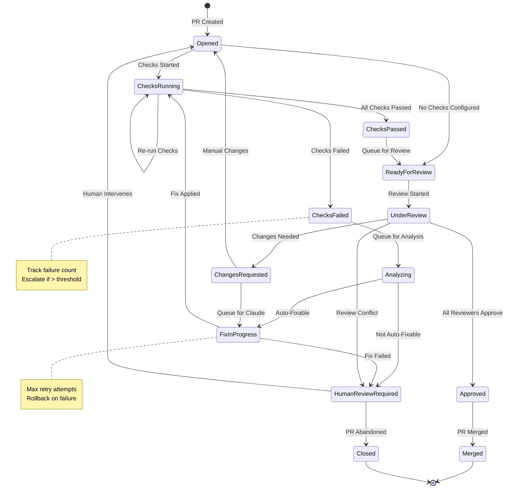

# PR Lifecycle State Machine

## Purpose
This diagram shows the complete lifecycle of a pull request as it flows through the agentic coding workflow system. It illustrates all possible states a PR can be in and the conditions that trigger state transitions.

## What It Shows
- **Complete PR Lifecycle**: From creation to final resolution
- **State Transitions**: All possible paths through the system
- **Decision Points**: Where the system makes routing decisions
- **Terminal States**: How PRs ultimately conclude (merged, closed, etc.)

## Key Insights
- **Non-Linear Flow**: PRs can cycle between states based on outcomes
- **Multiple Paths**: Different routes for different types of issues
- **Recovery Mechanisms**: Failed states can return to earlier phases
- **Human Intervention Points**: Clear escalation paths

## Diagram



## State Descriptions

### Initial States

#### Opened
- **Entry Condition**: PR is created or reopened
- **System Actions**: Register PR in database, check for existing checks
- **Next States**: ChecksRunning (if CI configured), ReadyForReview (if no checks)
- **Duration**: Immediate transition

#### ChecksRunning
- **Entry Condition**: CI/CD checks are executing
- **System Actions**: Monitor check status, wait for completion
- **Next States**: ChecksFailed, ChecksPassed, or stay in ChecksRunning
- **Duration**: Variable (depends on CI pipeline)

### Failure Handling States

#### ChecksFailed
- **Entry Condition**: One or more checks fail
- **System Actions**: Evaluate skip patterns, count consecutive failures
- **Next States**: Analyzing (if not skipped), ChecksRunning (if re-run)
- **Duration**: Immediate evaluation

#### Analyzing
- **Entry Condition**: Failed check needs LLM analysis
- **System Actions**: Fetch logs, send to LLM, categorize failure
- **Next States**: FixInProgress (auto-fixable), HumanReviewRequired (not fixable)
- **Duration**: 30-60 seconds (LLM response time)

#### FixInProgress
- **Entry Condition**: Analysis determines issue is auto-fixable
- **System Actions**: Apply fix using Claude Code, run tests, commit changes
- **Next States**: ChecksRunning (fix applied), HumanReviewRequired (fix failed)
- **Duration**: 2-5 minutes (fix application and validation)

### Review States

#### ReadyForReview
- **Entry Condition**: All checks pass or no checks configured
- **System Actions**: Queue for multi-agent review
- **Next States**: UnderReview
- **Duration**: Immediate queuing

#### UnderReview
- **Entry Condition**: Review process started
- **System Actions**: Execute parallel reviews, aggregate results
- **Next States**: Approved, ChangesRequested, HumanReviewRequired
- **Duration**: 1-2 minutes (parallel LLM reviews)

#### ChangesRequested
- **Entry Condition**: Reviewers request changes
- **System Actions**: Post comments, evaluate if auto-fixable
- **Next States**: FixInProgress (auto-fixable), Opened (manual changes)
- **Duration**: Immediate evaluation

### Terminal and Escalation States

#### Approved
- **Entry Condition**: All reviewers approve or consensus reached
- **System Actions**: Post approval, notify stakeholders
- **Next States**: Merged (if auto-merge enabled), or wait for manual merge
- **Duration**: Until human merges or auto-merge triggers

#### HumanReviewRequired
- **Entry Condition**: System cannot handle issue automatically
- **System Actions**: Notify humans, pause automation
- **Next States**: Opened (human fixes), Closed (abandon)
- **Duration**: Until human intervention

#### Merged
- **Entry Condition**: PR is merged by human or auto-merge
- **System Actions**: Clean up resources, update metrics
- **Next States**: Terminal state
- **Duration**: Final state

#### Closed
- **Entry Condition**: PR is closed without merging
- **System Actions**: Clean up resources, record outcome
- **Next States**: Terminal state
- **Duration**: Final state

## State Transition Conditions

### Automatic Transitions
```yaml
ChecksRunning -> ChecksFailed:
  condition: "any_check.status == 'failure'"
  
ChecksFailed -> Analyzing:
  condition: "not in skip_patterns and failure_count < threshold"
  
Analyzing -> FixInProgress:
  condition: "confidence > 80% and category in auto_fixable_categories"
```

### Manual Transitions
```yaml
HumanReviewRequired -> Opened:
  trigger: "human_intervention"
  actions: ["reset_failure_count", "update_status"]
  
Approved -> Merged:
  trigger: "merge_button_clicked or auto_merge_enabled"
```

### Time-Based Transitions
```yaml
ChecksRunning -> ChecksRunning:
  condition: "elapsed_time < max_check_duration"
  
FixInProgress -> HumanReviewRequired:
  condition: "elapsed_time > max_fix_duration"
```

## Error Recovery Patterns

### Retry Mechanisms
- **FixInProgress**: Retry up to 3 times before escalating
- **Analyzing**: Retry LLM calls with exponential backoff
- **UnderReview**: Retry failed reviewers independently

### Rollback Strategies
- **Failed Fix**: Revert changes and return to ChecksFailed
- **Invalid Analysis**: Re-queue for analysis with different provider
- **Review Timeout**: Escalate to human review

### Circuit Breakers
- **API Failures**: Stop processing if external APIs consistently fail
- **Cost Limits**: Pause LLM calls if budget exceeded
- **Resource Limits**: Queue requests if system overloaded

## Metrics and Monitoring

### State Duration Metrics
- **Time in ChecksRunning**: Indicates CI performance
- **Time in Analyzing**: Measures LLM response times
- **Time in FixInProgress**: Tracks fix application efficiency
- **Time in HumanReviewRequired**: Measures human response time

### Transition Frequency
- **Success Paths**: Opened → ChecksPassed → Approved → Merged
- **Failure Paths**: ChecksFailed → Analyzing → HumanReviewRequired
- **Fix Paths**: FixInProgress → ChecksRunning → ChecksPassed

### State Distribution
- **Active States**: Current distribution of PRs across states
- **Bottlenecks**: States with high dwell time
- **Terminal Rates**: Percentage reaching Merged vs Closed

## Configuration Options

### Timeouts
```yaml
state_timeouts:
  checks_running: 3600  # 1 hour max for CI
  analyzing: 300        # 5 minutes for LLM analysis
  fix_in_progress: 600  # 10 minutes for fix application
  under_review: 600     # 10 minutes for reviews
```

### Retry Limits
```yaml
retry_limits:
  fix_attempts: 3
  analysis_attempts: 2
  review_attempts: 1
```

### Escalation Thresholds
```yaml
escalation:
  consecutive_failures: 5
  time_in_state: 7200  # 2 hours
  cost_per_pr: 10.00   # USD
```